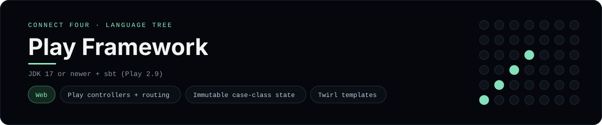

# Play Framework Implementation

A small Play Framework app that plays Connect Four in the browser - a
[framework showcase](../../README.md) alongside the console implementations in
[`languages/`](../../languages). Play is a Scala web framework, so this app
serves HTML instead of the byte-for-byte stdin/stdout console protocol, and the
dashboard shows one representative file from it rather than a single source
file.

## Prerequisites

* **Toolchain:** JDK 17 or newer + sbt
* **Check it is installed:** `java -version` and `sbt --version`

| Platform | Install command |
| --- | --- |
| Windows | `winget install Microsoft.OpenJDK.21` then `scoop install sbt` |
| macOS | `brew install openjdk sbt` |
| Debian/Ubuntu | `apt-get install default-jdk` (then install sbt) |

## How to run

Everything the app needs is under `frameworks/playframework/`; run it from that
folder:

```sh
cd frameworks/playframework
sbt run
```

Then open <http://localhost:9000> and play - the board is a 6x7 grid whose
bottom row is the first to fill, and the first player to line up four `X`s or
`O`s wins.

## How the game is built

* **Board** - `app/models/Board.scala` is an immutable
  `ConnectFourBoard` case class with the 6x7 rules: `drop`, `isFull`, `winner`
  and `lowestEmptyRow`. Both diagonals are checked from every cell, matching the
  win detection the console implementations use. It encodes itself to a string
  for the session.
* **Controller** - `app/controllers/GameController.scala` has `index`, `move`
  and `reset` actions. The board is read from the Play session, mutated, and
  written back before redirecting (post/redirect/get).
* **Route + view** - `conf/routes` maps the paths, and
  `app/views/board.scala.html` is the Twirl template that renders the grid.

## Skills demonstrated

* Play MVC controllers, actions and the session cookie
* Immutable `case class` state with `copy`/`updated`
* Twirl templates with pattern matching and comprehensions
* A `Vector[Vector[String]]` board with diagonal win detection

## Where the full app lives

The dashboard shows the controller, `app/controllers/GameController.scala`, and
links the whole folder on GitHub. Everything the app needs is under
`frameworks/playframework/`:

```
frameworks/playframework/
  app/models/Board.scala
  app/controllers/GameController.scala
  app/views/board.scala.html
  conf/routes
  build.sbt
```

The showcase dashboard shows this framework's representative file when you
open the **Frameworks** browse mode, addressable at `index.html?lang=playframework`.
