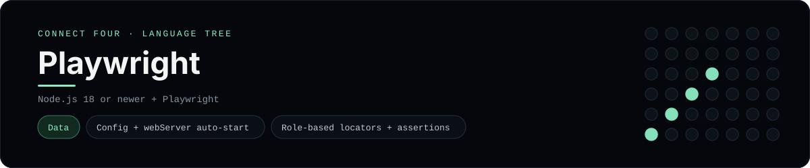

# Playwright Implementation

An end-to-end test suite that drives the Connect Four UI in a real browser - a
[framework showcase](../../README.md) alongside the console implementations in
[`languages/`](../../languages). Playwright automates browsers, so this project
asserts on the rendered page instead of the byte-for-byte stdin/stdout console
protocol, and the dashboard shows one representative file from it rather than a
single source file.

## Prerequisites

* **Toolchain:** Node.js 18 or newer
* **Check it is installed:** `node --version`

| Platform | Install command |
| --- | --- |
| Windows | `winget install OpenJS.NodeJS` |
| macOS | `brew install node` |
| Debian/Ubuntu | `apt-get install nodejs` |

## How to run

Everything the project needs is under `frameworks/playwright/`; run it from
that folder:

```sh
cd frameworks/playwright
npm install
npx playwright install
npm test
```

Playwright starts the app (via `webServer`), plays a full game in a headless
browser and reports the results; `npm run report` opens the HTML report.

## How the tests are built

* **Config** - `playwright.config.ts` points at `.ts` tests, sets a `baseURL`
  and starts the app automatically with a `webServer` block.
* **Spec** - `tests/connect-four.spec.ts` asserts the opening status, a
  horizontal win for `X`, a vertical win for `O`, a disabled full column and the
  reset button.
* **Helpers** - `tests/support/board.ts` shares the `dropDiscs` helper so tests
  read as game moves rather than locator noise.

## Skills demonstrated

* Playwright config, `webServer` and auto-starting the app
* Role-based locators (`getByRole`) and web-first assertions
* Fixtures (`beforeEach`), helpers and readable test steps
* Asserting real win/tie UI states end to end

## Where the full app lives

The dashboard shows the spec, `tests/connect-four.spec.ts`, and links the whole
folder on GitHub. Everything the project needs is under
`frameworks/playwright/`:

```
frameworks/playwright/
  playwright.config.ts
  tests/connect-four.spec.ts
  tests/support/board.ts
  package.json
```

The showcase dashboard shows this framework's representative file when you
open the **Frameworks** browse mode, addressable at
`index.html?lang=playwright`.
