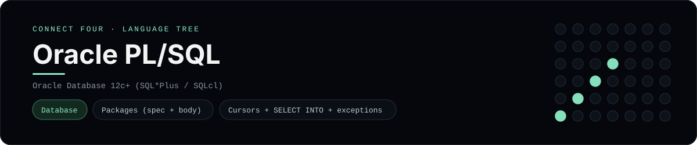

# Oracle PL/SQL Implementation

An Oracle PL/SQL package that plays Connect Four on top of the Oracle schema - a
[framework showcase](../../README.md) alongside the console implementations in
[`languages/`](../../languages). PL/SQL is a procedural database language, so it
answers with result sets/return values instead of the byte-for-byte
stdin/stdout console protocol, and the dashboard shows one representative file
from it rather than a single source file.

## Prerequisites

* **Toolchain:** Oracle Database 12c or newer with SQL*Plus (or SQLcl / Oracle
  Database Free in a container)
* **Check it is installed:** `sqlplus -V`

| Platform | Install command |
| --- | --- |
| Windows | Oracle Database Free in Docker: `docker run --name oracle -p 1521:1521 -e ORACLE_PASSWORD=... gvenzl/oracle-free` |
| macOS | Oracle Database Free in Docker (same image) |
| Debian/Ubuntu | Oracle Database Free in Docker (same image) |

## How to run

Everything the app needs is under `frameworks/plsql/`. Create the tables from the
Oracle sibling first, then install the package:

```sh
cd frameworks/plsql
sqlplus user/pass@localhost/freepdb1 @../oracle/schema.sql
sqlplus user/pass@localhost/freepdb1 @packages.sql
```

Then, at the `SQL>` prompt:

```sql
BEGIN
    connect_four_pkg.drop_disc (1, 1);
    connect_four_pkg.drop_disc (1, 1);
    connect_four_pkg.drop_disc (1, 2);
    connect_four_pkg.drop_disc (1, 2);
    connect_four_pkg.drop_disc (1, 3);
    connect_four_pkg.drop_disc (1, 3);
    connect_four_pkg.drop_disc (1, 4);
    DBMS_OUTPUT.PUT_LINE (connect_four_pkg.board (1));
    DBMS_OUTPUT.PUT_LINE (NVL (connect_four_pkg.winner (1), 'no winner yet'));
END;
/
```

## How the game is built

* **Package spec/body** - `packages.sql` declares and defines a single
  `connect_four_pkg` package: `player_at` reads one disc, `has_line` scans all
  four directions, `winner` loops over the two players, `board` renders the 6x7
  grid as text and `drop_disc` inserts the next legal move.
* **PL/SQL features** - `%TYPE`-style numeric parameters, `SELECT ... INTO` with
  a `NO_DATA_FOUND` handler, `FOR ... LOOP` (including `REVERSE`), a
  `CASE`/`MOD` turn switch and `RAISE_APPLICATION_ERROR` for illegal columns.
* **Tables** - the shared `games`/`moves` schema and the `cells` window-function
  view come from the Oracle Database folder.

## Skills demonstrated

* Packages (spec + body) and local subprogram calls
* Cursors, `SELECT INTO`, and named exception handlers
* Range `FOR` loops and `REVERSE` iteration to render a grid
* `RAISE_APPLICATION_ERROR` for validation

## Where the full app lives

The dashboard shows the package, `packages.sql`, and links the whole folder on
GitHub. Everything the app needs is under `frameworks/plsql/`:

```
frameworks/plsql/
  packages.sql
```

The showcase dashboard shows this framework's representative file when you
open the **Frameworks** browse mode, addressable at `index.html?lang=plsql`.
