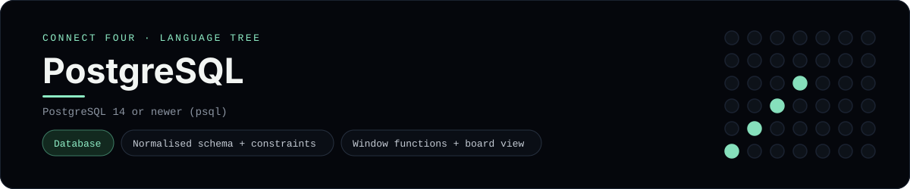

# PostgreSQL Implementation

A pure-SQL Connect Four that stores games in PostgreSQL and computes the board
and winner in the database - a [framework showcase](../../README.md) alongside
the console implementations in [`languages/`](../../languages). PostgreSQL
serves rows instead of the byte-for-byte stdin/stdout console protocol, and the
dashboard shows one representative file from it rather than a single source
file.

## Prerequisites

* **Toolchain:** PostgreSQL 14 or newer (the `psql` client)
* **Check it is installed:** `psql --version`

| Platform | Install command |
| --- | --- |
| Windows | `winget install PostgreSQL.PostgreSQL` |
| macOS | `brew install postgresql` |
| Debian/Ubuntu | `apt-get install postgresql` |

## How to run

Everything the app needs is under `frameworks/postgresql/`; run it from that
folder against a database:

```sh
cd frameworks/postgresql
createdb connect_four
psql connect_four < schema.sql
psql connect_four < seed.sql
psql connect_four -c "SELECT * FROM board(1);"
psql connect_four -c "SELECT winner(1);"
```

The seed plays a horizontal win for `X`, so `winner(1)` returns `X`.

## How the game is built

* **Schema** - `schema.sql` normalises a game into a `games` row plus one `moves`
  row per turn (player + column), with CHECK constraints and a unique
  `(game_id, turn)`.
* **Board** - the `cells` view assigns each disc its `row_number` per column with
  `ROW_NUMBER() OVER (PARTITION BY game_id, column_number ORDER BY turn)`, and
  the `board(game_id)` function turns that into a 6x7 text grid.
* **Rules** - `drop_disc(game_id, column)` inserts the next legal move, and
  `winner(game_id)` joins the `cells` view against itself in all four
  directions to detect a line of four - the same diagonal-aware detection the
  console implementations use.
* **Seed** - `seed.sql` plays a short game so the views return something
  immediately.

## Skills demonstrated

* Normalised schema design with constraints and indexes
* Window functions (`ROW_NUMBER() OVER (PARTITION BY ...)`)
* Set-returning functions, `generate_series` and array aggregation
* Win detection as a self-join across all four directions

## Where the full app lives

The dashboard shows the schema, `schema.sql`, and links the whole folder on
GitHub. Everything the app needs is under `frameworks/postgresql/`:

```
frameworks/postgresql/
  schema.sql
  seed.sql
```

The showcase dashboard shows this framework's representative file when you
open the **Frameworks** browse mode, addressable at
`index.html?lang=postgresql`.
