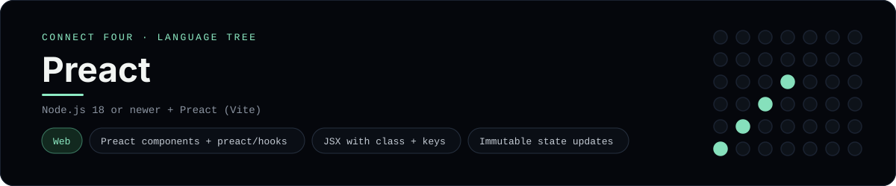

# Preact Implementation

A small Preact app that plays Connect Four in the browser - a
[framework showcase](../../README.md) alongside the console implementations in
[`languages/`](../../languages). Preact is a tiny React-compatible UI library, so
this app renders components in the browser instead of the byte-for-byte
stdin/stdout console protocol, and the dashboard shows one representative file
from it rather than a single source file.

## Prerequisites

* **Toolchain:** Node.js 18 or newer
* **Check it is installed:** `node --version`

| Platform | Install command |
| --- | --- |
| Windows | `winget install OpenJS.NodeJS` |
| macOS | `brew install node` |
| Debian/Ubuntu | `apt-get install nodejs` |

## How to run

Everything the app needs is under `frameworks/preact/`; run it from that folder:

```sh
cd frameworks/preact
npm install
npm run dev
```

Then open the printed <http://localhost:5173> and play - the board is a 6x7 grid
whose bottom row is the first to fill, and the first player to line up four
`X`s or `O`s wins.

## How the game is built

* **Component** - `src/connect-four.jsx` holds the board and move count in
  `useState` (from `preact/hooks`), renders the grid, and derives the winner,
  "tie" and "whose turn" status on every render.
* **Board** - `src/board.js` is plain JavaScript with the 6x7 rules (`drop`,
  `isColumnFull`, `winner`, `lowestEmptyRow`); every update returns a fresh
  board so state stays immutable, and both diagonals are checked from every cell.
* **Entry** - `src/main.jsx` mounts the component with Preact's `render`, and
  `index.html` is the Vite root page.

## Skills demonstrated

* Preact components with `preact/hooks` (`useState`)
* JSX with Preact's `class` attribute and stable `key`s
* Immutable updates and derived status
* An array-of-arrays board with diagonal win detection

## Where the full app lives

The dashboard shows the component, `src/connect-four.jsx`, and links the whole
folder on GitHub. Everything the app needs is under `frameworks/preact/`:

```
frameworks/preact/
  src/board.js
  src/connect-four.jsx
  src/main.jsx
  index.html
  vite.config.js
  package.json
```

The showcase dashboard shows this framework's representative file when you
open the **Frameworks** browse mode, addressable at `index.html?lang=preact`.
