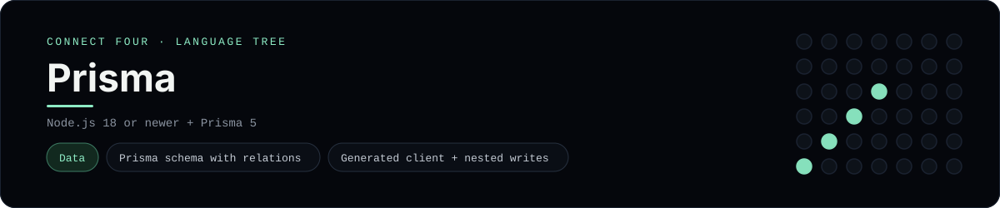

# Prisma Implementation

A small Prisma data layer that stores and replays Connect Four games - a
[framework showcase](../../README.md) alongside the console implementations in
[`languages/`](../../languages). Prisma is a type-safe ORM, so this app models
the game in a database instead of using the byte-for-byte stdin/stdout console
protocol, and the dashboard shows one representative file from it rather than a
single source file.

## Prerequisites

* **Toolchain:** Node.js 18 or newer
* **Check it is installed:** `node --version`

| Platform | Install command |
| --- | --- |
| Windows | `winget install OpenJS.NodeJS` |
| macOS | `brew install node` |
| Debian/Ubuntu | `apt-get install nodejs` |

## How to run

Everything the app needs is under `frameworks/prisma/`; run it from that folder:

```sh
cd frameworks/prisma
npm install
echo 'DATABASE_URL="file:./dev.db"' > .env
npx prisma migrate dev --name init
```

Then query the data with `npx prisma studio`. The schema stores every game and
its moves - the first player to line up four discs wins.

## How the game is built

* **Schema** - `prisma/schema.prisma` defines a `Game` with many `Move` rows
  (player + column), the minimal normalised shape for a Connect-Four history.
* **Service** - `src/gameService.ts` loads a game's moves, replays them onto a
  `ConnectFourBoard`, validates a new move and persists it. Type-safe queries
  come straight from the generated `PrismaClient`.
* **Board** - `src/board.ts` holds the 6x7 rules: `play`, `isFull`, `winner` and
  `lowestEmptyRow`, with both diagonals checked from every cell.

## Skills demonstrated

* Prisma schema modelling with relations and indexes
* The generated client, `findUniqueOrThrow` and nested writes
* Replaying event-sourced moves into in-memory state
* A class-based board with diagonal win detection

## Where the full app lives

The dashboard shows the service, `src/gameService.ts`, and links the whole
folder on GitHub. Everything the app needs is under `frameworks/prisma/`:

```
frameworks/prisma/
  prisma/schema.prisma
  src/board.ts
  src/gameService.ts
  package.json
```

The showcase dashboard shows this framework's representative file when you
open the **Frameworks** browse mode, addressable at `index.html?lang=prisma`.
