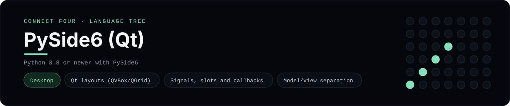

# PySide6 (Qt) Implementation

A small PySide6 app that plays Connect Four as a desktop window - a
[framework showcase](../../README.md) alongside the console implementations in
[`languages/`](../../languages). PySide6 is the official Qt binding for Python,
so this app draws Qt widgets instead of the byte-for-byte stdin/stdout console
protocol, and the dashboard shows one representative file from it rather than a
single source file.

## Prerequisites

* **Toolchain:** Python 3.8 or newer with PySide6
* **Check it is installed:** `python --version` and `python -c "import PySide6"`

| Platform | Install command |
| --- | --- |
| Windows | `pip install PySide6` |
| macOS | `pip install PySide6` |
| Debian/Ubuntu | `pip install PySide6` |

## How to run

Everything the app needs is under `frameworks/pyside6/`; run it from that
folder:

```sh
cd frameworks/pyside6
pip install PySide6
python main.py
```

A desktop window opens - the board is a 6x7 grid whose bottom row is the first
to fill, and the first player to line up four discs wins.

## How the game is built

* **Board** - `board.py` holds the 6x7 board and the rules: `drop`, `is_full`,
  `winner` and `lowest_empty_row`. Both diagonals are checked from every cell,
  matching the win detection the console implementations use.
* **Window** - `main.py` is a `QMainWindow` that lays out a `QGridLayout` of
  round `QLabel` discs and a row of `QPushButton`s, and rebuilds both on every
  move. The game model is kept completely out of the widgets.

## Skills demonstrated

* Qt widget layout with `QVBoxLayout` and `QGridLayout`
* Signal/slot wiring and lambda callbacks with default-argument binding
* Styling discs with Qt style sheets (`border-radius`)
* A model/view split with diagonal win detection

## Where the full app lives

The dashboard shows the window, `main.py`, and links the whole folder on GitHub.
Everything the app needs is under `frameworks/pyside6/`:

```
frameworks/pyside6/
  board.py
  main.py
```

The showcase dashboard shows this framework's representative file when you
open the **Frameworks** browse mode, addressable at `index.html?lang=pyside6`.
