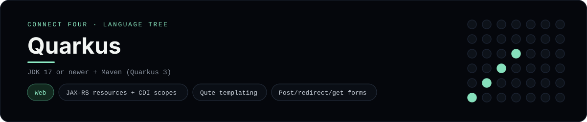

# Quarkus Implementation

A small Quarkus app that plays Connect Four in the browser - a
[framework showcase](../../README.md) alongside the console implementations in
[`languages/`](../../languages). Quarkus is a cloud-native Java framework, so
this app serves HTML instead of the byte-for-byte stdin/stdout console protocol,
and the dashboard shows one representative file from it rather than a single
source file.

## Prerequisites

* **Toolchain:** JDK 17 or newer + Maven
* **Check it is installed:** `java -version` and `mvn --version`

| Platform | Install command |
| --- | --- |
| Windows | `winget install Microsoft.OpenJDK.21` |
| macOS | `brew install openjdk` |
| Debian/Ubuntu | `apt-get install default-jdk` |

## How to run

Everything the app needs is under `frameworks/quarkus/`; run it from that
folder:

```sh
cd frameworks/quarkus
mvn quarkus:dev
```

Then open <http://localhost:8080> and play - the board is a 6x7 grid whose
bottom row is the first to fill, and the first player to line up four `X`s or
`O`s wins.

## How the game is built

* **Board** - `src/main/java/.../Board.java` holds the 6x7 rules: `drop`,
  `isFull`, `winner` and `lowestEmptyRow`. Both diagonals are checked from every
  cell, matching the win detection the console implementations use.
* **Resource** - `src/main/java/.../GameResource.java` is a JAX-RS resource with
  `GET /`, `POST /move` and `POST /reset`. The game lives in a `@SessionScoped`
  CDI bean so it survives across requests, and every mutation redirects back
  (post/redirect/get).
* **Template** - `src/main/resources/templates/board.html` is a Qute template
  that renders the grid and the column buttons.

## Skills demonstrated

* Quarkus / JAX-RS REST resources and CDI scopes
* Qute templating with loops and conditionals
* Form handling with post/redirect/get
* A 2-D array board with diagonal win detection

## Where the full app lives

The dashboard shows the JAX-RS resource, `GameResource.java`, and links the
whole folder on GitHub. Everything the app needs is under
`frameworks/quarkus/`:

```
frameworks/quarkus/
  src/main/java/com/example/connectfour/Board.java
  src/main/java/com/example/connectfour/GameResource.java
  src/main/resources/templates/board.html
  pom.xml
```

The showcase dashboard shows this framework's representative file when you
open the **Frameworks** browse mode, addressable at `index.html?lang=quarkus`.
