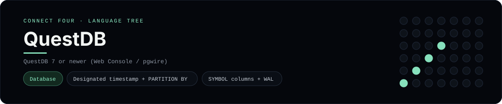

# QuestDB Implementation

A QuestDB schema and query set that time-indexes Connect Four moves - a
[framework showcase](../../README.md) alongside the console implementations in
[`languages/`](../../languages). QuestDB is a time-series database, so it answers
with result sets instead of the byte-for-byte stdin/stdout console protocol, and
the dashboard shows one representative file from it rather than a single source
file.

## Prerequisites

* **Toolchain:** QuestDB 7 or newer (the Web Console or the PostgreSQL wire
  protocol on port 8812)
* **Check it is installed:** open <http://localhost:9000> after starting QuestDB

| Platform | Install command |
| --- | --- |
| Windows | QuestDB in Docker: `docker run --name questdb -p 9000:9000 -p 8812:8812 questdb/questdb` |
| macOS | `brew install questdb` or the same Docker image |
| Debian/Ubuntu | the same Docker image |

## How to run

Everything the app needs is under `frameworks/questdb/`; paste the scripts into
the Web Console at <http://localhost:9000>:

```sh
cd frameworks/questdb
# open http://localhost:9000 and run schema.sql, then queries.sql
```

Then run `queries.sql` - it finds the latest disc per column, buckets moves per
second with `SAMPLE BY`, and joins each game to its most recent move.

## How the game is built

* **Schema** - `schema.sql` creates append-only tables with a designated
  `TIMESTAMP` column and `PARTITION BY DAY`/`MONTH`, plus `SYMBOL` columns for
  the low-cardinality player names (and `WAL` for write-ahead logging).
* **Queries** - `queries.sql` inserts a game and its moves, then uses QuestDB's
  time-series operators: `LATEST ON ... PARTITION BY` for the newest disc per
  column, `SAMPLE BY 1s` for moves per second, and `ASOF JOIN` to attach the
  last move to each game.

## Skills demonstrated

* Designated timestamps, `PARTITION BY` and `SYMBOL` columns
* `LATEST ON ... PARTITION BY` for per-key latest rows
* `SAMPLE BY` time bucketing and `ASOF JOIN`
* Bulk inserts from a `VALUES` table

## Where the full app lives

The dashboard shows the schema, `schema.sql`, and links the whole folder on
GitHub. Everything the app needs is under `frameworks/questdb/`:

```
frameworks/questdb/
  schema.sql
  queries.sql
```

The showcase dashboard shows this framework's representative file when you
open the **Frameworks** browse mode, addressable at `index.html?lang=questdb`.
