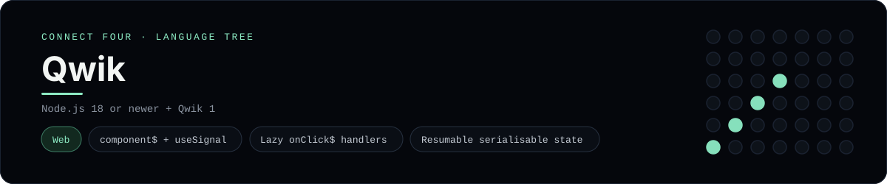

# Qwik Implementation

A small Qwik app that plays Connect Four in the browser - a
[framework showcase](../../README.md) alongside the console implementations in
[`languages/`](../../languages). Qwik is a resumable web framework, so this app
renders components in the browser instead of the byte-for-byte stdin/stdout
console protocol, and the dashboard shows one representative file from it
rather than a single source file.

## Prerequisites

* **Toolchain:** Node.js 18 or newer
* **Check it is installed:** `node --version`

| Platform | Install command |
| --- | --- |
| Windows | `winget install OpenJS.NodeJS` |
| macOS | `brew install node` |
| Debian/Ubuntu | `apt-get install nodejs` |

## How to run

Everything the app needs is under `frameworks/qwik/`; run it from that folder:

```sh
cd frameworks/qwik
npm install
npm run dev
```

Then open the printed <http://localhost:5173> and play - the board is a 6x7
grid whose bottom row is the first to fill, and the first player to line up
four `X`s or `O`s wins.

## How the game is built

* **Board** - `src/lib/board.ts` is plain TypeScript with the 6x7 rules:
  `drop`, `isColumnFull`, `winner` and `lowestEmptyRow`. Both diagonals are
  checked from every cell, matching the win detection the console
  implementations use.
* **Route** - `src/routes/index.tsx` is a `component$` that keeps the board and
  move count in `useSignal`, renders the grid, and rewires state inside lazily
  loaded `onClick$` handlers so Qwik can resume the page without re-running it.

## Skills demonstrated

* Qwik `component$` components and the `useSignal` store
* Lazy `onClick$` event handlers (resumability)
* Serialisable state that survives server-to-client handoff
* An array-of-arrays board with diagonal win detection

## Where the full app lives

The dashboard shows the route, `src/routes/index.tsx`, and links the whole
folder on GitHub. Everything the app needs is under `frameworks/qwik/`:

```
frameworks/qwik/
  src/lib/board.ts
  src/routes/index.tsx
  package.json
```

The showcase dashboard shows this framework's representative file when you
open the **Frameworks** browse mode, addressable at `index.html?lang=qwik`.
