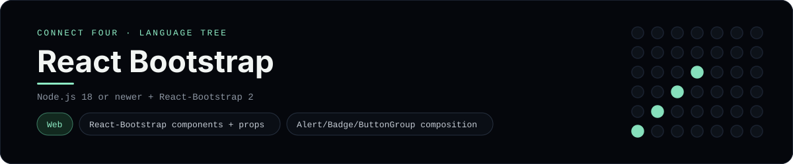

# React Bootstrap Implementation

A small React app that plays Connect Four with React-Bootstrap components - a
[framework showcase](../../README.md) alongside the console implementations in
[`languages/`](../../languages). React-Bootstrap replaces Bootstrap's jQuery-era
plugins with React components, so this app renders components in the browser
instead of the byte-for-byte stdin/stdout console protocol, and the dashboard
shows one representative file from it rather than a single source file.

## Prerequisites

* **Toolchain:** Node.js 18 or newer
* **Check it is installed:** `node --version`

| Platform | Install command |
| --- | --- |
| Windows | `winget install OpenJS.NodeJS` |
| macOS | `brew install node` |
| Debian/Ubuntu | `apt-get install nodejs` |

## How to run

Everything the app needs is under `frameworks/reactbootstrap/`; run it from that
folder:

```sh
cd frameworks/reactbootstrap
npm install
npm run dev
```

Then open the printed <http://localhost:5173> and play - the board is a 6x7 grid
whose bottom row is the first to fill, and the first player to line up four
`X`s or `O`s wins.

## How the game is built

* **Component** - `src/ConnectFour.jsx` holds the board and move count in
  `useState` and composes the page from React-Bootstrap components: `Container`,
  `Alert` (whose `variant` swaps as the game progresses), `Badge`, `Card`,
  `Table` and a `ButtonGroup` of column `Button`s.
* **Board** - `src/board.js` is plain JavaScript with the 6x7 rules (`drop`,
  `isColumnFull`, `winner`, `lowestEmptyRow`); every update returns a fresh
  board, and both diagonals are checked from every cell.
* **Entry** - `src/main.jsx` imports Bootstrap's CSS and mounts the component;
  `index.html` sets `data-bs-theme="dark"`.

## Skills demonstrated

* React-Bootstrap components and props (`variant`, `bg`, `disabled`)
* Composing UI from a component library instead of raw markup
* React state with derived status and immutable updates
* An array-of-arrays board with diagonal win detection

## Where the full app lives

The dashboard shows the component, `src/ConnectFour.jsx`, and links the whole
folder on GitHub. Everything the app needs is under
`frameworks/reactbootstrap/`:

```
frameworks/reactbootstrap/
  src/board.js
  src/ConnectFour.jsx
  src/main.jsx
  index.html
  vite.config.js
  package.json
```

The showcase dashboard shows this framework's representative file when you
open the **Frameworks** browse mode, addressable at
`index.html?lang=reactbootstrap`.
