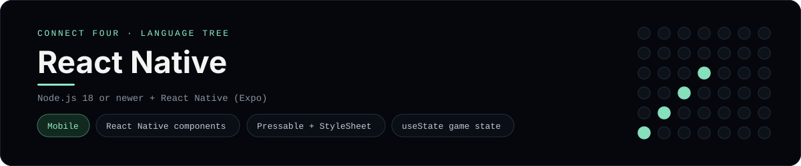

# React Native Implementation

A small React Native app that plays Connect Four on a phone - a
[framework showcase](../../README.md) alongside the console implementations in
[`languages/`](../../languages). React Native is a mobile framework, so this app
renders native components (`View`, `Text`, `Pressable`) instead of the
byte-for-byte stdin/stdout console protocol, and the dashboard shows one
representative file from it rather than a single source file.

## Prerequisites

* **Toolchain:** Node.js 18 or newer and Expo (`npx expo`)
* **Check it is installed:** `node --version`

| Platform | Install command |
| --- | --- |
| Windows | `winget install OpenJS.NodeJS` |
| macOS | `brew install node` |
| Debian/Ubuntu | `apt-get install nodejs` |

## How to run

Generate a React Native (Expo) project and drop the app files into it (the app
is a slice, so the scaffolding comes from the template):

```sh
npx create-expo-app connectfour --template blank
cp frameworks/reactnative/App.jsx connectfour/App.jsx
cp -r frameworks/reactnative/src/. connectfour/src/
cd connectfour && npx expo start
```

Then press `a` for an Android emulator, `i` for the iOS simulator, or scan the
QR code with Expo Go - the board is a 6x7 grid whose bottom row is the first to
fill, and the first player to line up four `X`s or `O`s wins.

## How the game is built

* **Board** - `src/board.js` is plain JavaScript with the 6x7 rules: `drop`,
  `isColumnFull`, `winner` and `lowestEmptyRow`. Every update returns a fresh
  board so React state stays immutable, and both diagonals are checked from
  every cell, matching the win detection the console implementations use.
* **Component** - `src/ConnectFour.jsx` holds the board and move count in
  `useState` and renders the grid with `View` / `Text` and the column buttons
  with `Pressable`, styled through `StyleSheet`.
* **Entry** - `App.jsx` wraps the component in a `SafeAreaView`, the standard
  React Native shell.

## Skills demonstrated

* React Native primitives (`View`, `Text`, `Pressable`, `SafeAreaView`)
* `StyleSheet` and flexbox layout on mobile
* The `useState` hook with immutable board updates
* An array-of-arrays board with diagonal win detection

## Where the full app lives

The dashboard shows the component, `src/ConnectFour.jsx`, and links the whole
folder on GitHub. Everything the app needs is under `frameworks/reactnative/`:

```
frameworks/reactnative/
  App.jsx
  src/ConnectFour.jsx
  src/board.js
```

The showcase dashboard shows this framework's representative file when you
open the **Frameworks** browse mode, addressable at `index.html?lang=reactnative`.
