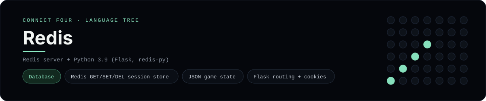

# Redis Implementation

A small Flask app that keeps each Connect Four game in Redis - a
[framework showcase](../../README.md) alongside the console implementations in
[`languages/`](../../languages). Redis is the in-memory data store that backs
most session/cache layers, so this app persists the board there instead of the
byte-for-byte stdin/stdout console protocol, and the dashboard shows one
representative file from it rather than a single source file.

## Prerequisites

* **Toolchain:** Python 3.9 or newer with Flask + redis-py, and a Redis server
* **Check it is installed:** `python --version` and `redis-cli ping`

| Platform | Install command |
| --- | --- |
| Windows | `winget install Redis.Redis` then `pip install Flask redis` |
| macOS | `brew install redis` then `pip install Flask redis` |
| Debian/Ubuntu | `apt-get install redis-server` then `pip install Flask redis` |

## How to run

Everything the app needs is under `frameworks/redis/`; run it from that folder:

```sh
cd frameworks/redis
pip install -r requirements.txt
redis-server
python app.py
```

Then open <http://localhost:5000> and play - the board is a 6x7 grid whose
bottom row is the first to fill, and the first player to line up four `X`s or
`O`s wins. Each browser session gets its own `connectfour:<id>` key.

## How the game is built

* **Board** - `board.py` holds the 6x7 board and the rules: `drop`, `is_full`,
  `winner` and `lowest_empty_row`. It serialises to JSON so a whole game fits in
  one Redis string, and both diagonals are checked from every cell.
* **App** - `app.py` keeps a random key in the Flask cookie session and reads
  and writes the board with `GET`/`SET`, so no database schema is needed.
  `POST /move` and `POST /reset` mutate the key and redirect back
  (post/redirect/get).

## Skills demonstrated

* Redis `GET`/`SET`/`DEL` as a session store
* Flask routing with post/redirect/get and signed cookies
* JSON round-tripping of game state
* A list-of-lists board with diagonal win detection

## Where the full app lives

The dashboard shows the app, `app.py`, and links the whole folder on GitHub.
Everything the app needs is under `frameworks/redis/`:

```
frameworks/redis/
  board.py
  app.py
  templates/board.html
  requirements.txt
```

The showcase dashboard shows this framework's representative file when you
open the **Frameworks** browse mode, addressable at `index.html?lang=redis`.
