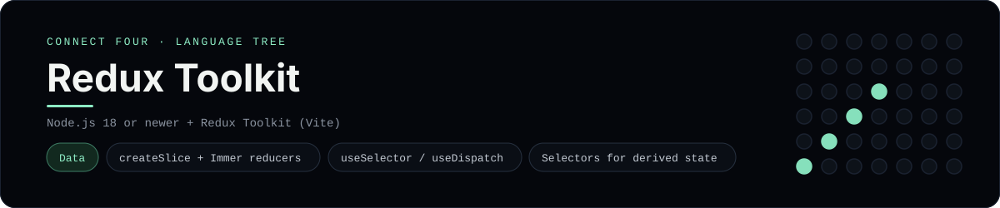

# Redux Toolkit Implementation

A small React + Redux Toolkit app that plays Connect Four in the browser - a
[framework showcase](../../README.md) alongside the console implementations in
[`languages/`](../../languages). Redux Toolkit is the standard state layer for
React apps, so this app keeps the game in a global store instead of the
byte-for-byte stdin/stdout console protocol, and the dashboard shows one
representative file from it rather than a single source file.

## Prerequisites

* **Toolchain:** Node.js 18 or newer
* **Check it is installed:** `node --version`

| Platform | Install command |
| --- | --- |
| Windows | `winget install OpenJS.NodeJS` |
| macOS | `brew install node` |
| Debian/Ubuntu | `apt-get install nodejs` |

## How to run

Everything the app needs is under `frameworks/redux/`; run it from that folder:

```sh
cd frameworks/redux
npm install
npm run dev
```

Then open the printed <http://localhost:5173> and play - the board is a 6x7
grid whose bottom row is the first to fill, and the first player to line up
four `X`s or `O`s wins.

## How the game is built

* **Slice** - `src/features/game/gameSlice.js` uses `createSlice` for the
  `play` and `reset` reducers and exports memo-free selectors (`selectStatus`,
  `selectOver`). Both diagonals are checked from every cell.
* **Store** - `src/store.js` wires the reducer with `configureStore`.
* **Components** - `src/App.jsx` reads the board with `useSelector` and
  dispatches `play`/`reset` with `useDispatch`; `src/board.js` is the pure
  6x7 rules engine.

## Skills demonstrated

* Redux Toolkit `createSlice` with Immer-style reducers
* `configureStore`, `useSelector` and `useDispatch`
* Derived state via selectors
* An array-of-arrays board with diagonal win detection

## Where the full app lives

The dashboard shows the slice, `src/features/game/gameSlice.js`, and links the
whole folder on GitHub. Everything the app needs is under `frameworks/redux/`:

```
frameworks/redux/
  src/features/game/gameSlice.js
  src/board.js
  src/store.js
  src/App.jsx
  src/main.jsx
  package.json
```

The showcase dashboard shows this framework's representative file when you
open the **Frameworks** browse mode, addressable at `index.html?lang=redux`.
