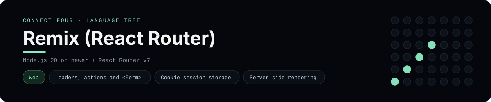

# Remix (React Router v7) Implementation

A small React Router (the framework formerly called Remix) app that plays
Connect Four in the browser - a [framework showcase](../../README.md) alongside
the console implementations in [`languages/`](../../languages). React Router is
a full-stack web framework, so this app renders HTML through loaders and actions
instead of the byte-for-byte stdin/stdout console protocol, and the dashboard
shows one representative file from it rather than a single source file.

## Prerequisites

* **Toolchain:** Node.js 20 or newer
* **Check it is installed:** `node --version`

| Platform | Install command |
| --- | --- |
| Windows | `winget install OpenJS.NodeJS` |
| macOS | `brew install node` |
| Debian/Ubuntu | `apt-get install nodejs` |

## How to run

Everything the app needs is under `frameworks/remix/`; run it from that folder:

```sh
cd frameworks/remix
npm install
npm run dev
```

Then open the printed <http://localhost:5173> and play - the board is a 6x7
grid whose bottom row is the first to fill, and the first player to line up
four `X`s or `O`s wins.

## How the game is built

* **Board** - `app/lib/board.ts` is plain TypeScript with the 6x7 rules:
  `drop`, `isColumnFull`, `winner` and `lowestEmptyRow`. Both diagonals are
  checked from every cell, matching the win detection the console
  implementations use.
* **Route** - `app/routes/home.tsx` reads the game in a `loader` and mutates it
  in an `action`, so every move is a normal `<Form method="post">` submission
  and the board is server-rendered on every request.
* **Session** - `app/lib/session.server.ts` keeps the board in a signed cookie
  session with `createCookieSessionStorage`, so no database is needed.

## Skills demonstrated

* React Router v7 loaders, actions and `<Form>` submissions
* Cookie session storage and server-side rendering
* Shared TypeScript board logic across server and client
* An array-of-arrays board with diagonal win detection

## Where the full app lives

The dashboard shows the route, `app/routes/home.tsx`, and links the whole
folder on GitHub. Everything the app needs is under `frameworks/remix/`:

```
frameworks/remix/
  app/lib/board.ts
  app/lib/session.server.ts
  app/routes/home.tsx
  app/routes.ts
  app/root.tsx
  vite.config.ts
  package.json
```

The showcase dashboard shows this framework's representative file when you
open the **Frameworks** browse mode, addressable at `index.html?lang=remix`.
