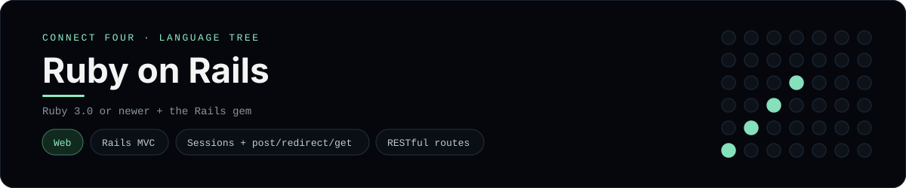

# Ruby on Rails Implementation

A small Rails MVC app that plays Connect Four in the browser - a
[framework showcase](../../README.md) alongside the console implementations in
[`languages/`](../../languages). Rails is a web framework, so this app serves
HTML instead of the byte-for-byte stdin/stdout console protocol, and the
dashboard shows one representative file from it rather than a single source
file.

## Prerequisites

* **Toolchain:** Ruby 3.0 or newer and the Rails gem
* **Check it is installed:** `ruby --version` and `rails --version`

| Platform | Install command |
| --- | --- |
| Windows | `gem install rails` |
| macOS | `gem install rails` |
| Debian/Ubuntu | `gem install rails` |

## How to run

Generate a Rails app and drop these files into it (the app is a slice, so the
scaffolding comes from `rails new`):

```sh
rails new connect_four --skip-active-record --skip-javascript
cp -r frameworks/rubyonrails/app/. connect_four/app/
cp frameworks/rubyonrails/config/routes.rb connect_four/config/routes.rb
cd connect_four && bin/rails server
```

Then open <http://localhost:3000> and play - the board is a 6x7 grid whose
bottom row is the first to fill, and the first player to line up four `X`s or
`O`s wins.

## How the game is built

* **Model** - `app/models/connect_four_game.rb` holds the 6x7 board and the
  rules: `drop`, `column_full?`, `winner`, `full?` and `finished?`. The board is
  an array of arrays and both diagonals are checked from every cell, matching
  the win detection the console implementations use.
* **Controller** - `app/controllers/games_controller.rb` keeps the game in the
  session, validates the chosen column, applies the move and redirects back
  (post/redirect/get), so a refresh never re-plays a move.
* **View** - `app/views/games/show.html.erb` renders the board as a table and a
  row of `button_to` column buttons; the status line announces whose turn it is
  or who won.
* **Routes** - `config/routes.rb` maps `/` to the game, `POST /move` to a drop
  and `DELETE /reset` to a fresh board.

## Skills demonstrated

* Rails MVC: models, controllers, views and RESTful routes
* Sessions for game state, post/redirect/get to avoid resubmission
* `button_to`, `flash.now`, helper paths (`move_path`, `reset_path`)
* An array-of-arrays board with diagonal win detection

## Where the full app lives

The dashboard shows the controller, `app/controllers/games_controller.rb`, and
links the whole folder on GitHub. Everything the app needs is under
`frameworks/rubyonrails/`:

```
frameworks/rubyonrails/
  app/controllers/games_controller.rb
  app/models/connect_four_game.rb
  app/views/games/show.html.erb
  config/routes.rb
```

The showcase dashboard shows this framework's representative file when you
open the **Frameworks** browse mode, addressable at `index.html?lang=rubyonrails`.
