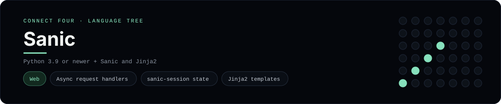

# Sanic Implementation

A small Sanic app that plays Connect Four in the browser - a
[framework showcase](../../README.md) alongside the console implementations in
[`languages/`](../../languages). Sanic is an async Python web framework, so this
app serves HTML instead of the byte-for-byte stdin/stdout console protocol, and
the dashboard shows one representative file from it rather than a single source
file.

## Prerequisites

* **Toolchain:** Python 3.9 or newer with Sanic, sanic-session and Jinja2
* **Check it is installed:** `python --version` and `python -c "import sanic"`

| Platform | Install command |
| --- | --- |
| Windows | `pip install sanic sanic-session Jinja2` |
| macOS | `pip install sanic sanic-session Jinja2` |
| Debian/Ubuntu | `pip install sanic sanic-session Jinja2` |

## How to run

Everything the app needs is under `frameworks/sanic/`; run it from that folder:

```sh
cd frameworks/sanic
pip install -r requirements.txt
python app.py
```

Then open <http://localhost:8000> and play - the board is a 6x7 grid whose
bottom row is the first to fill, and the first player to line up four `X`s or
`O`s wins.

## How the game is built

* **Board** - `board.py` holds the 6x7 board and the rules: `drop`, `is_full`,
  `winner`, `is_over` and `has_line`. It round-trips through plain dicts so it
  can live in the session, and both diagonals are checked from every cell,
  matching the win detection the console implementations use.
* **App** - `app.py` wires the `sanic-session` middleware and three async
  handlers: `GET /` renders the board with Jinja2, `POST /move` and
  `POST /reset` mutate the session and redirect back (post/redirect/get).

## Skills demonstrated

* Async request handlers and Sanic routing
* `sanic-session` state with post/redirect/get
* Jinja2 templating over a list-of-lists board
* Diagonal win detection shared with the console implementations

## Where the full app lives

The dashboard shows the app entry point, `app.py`, and links the whole folder
on GitHub. Everything the app needs is under `frameworks/sanic/`:

```
frameworks/sanic/
  board.py
  app.py
  templates/board.html
  requirements.txt
```

The showcase dashboard shows this framework's representative file when you
open the **Frameworks** browse mode, addressable at `index.html?lang=sanic`.
