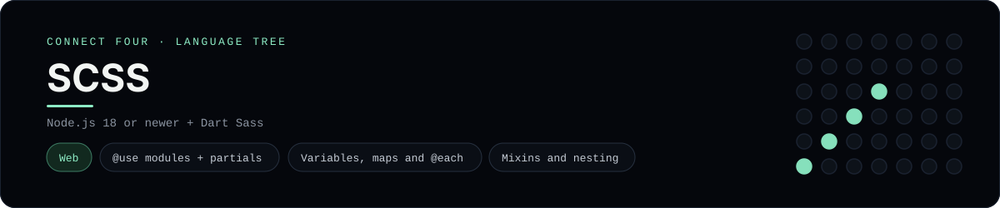

# SCSS Implementation

A small Dart Sass (SCSS) project that styles a Connect Four page - a
[framework showcase](../../README.md) alongside the console implementations in
[`languages/`](../../languages). SCSS is a CSS preprocessor, so it compiles to a
stylesheet rather than the byte-for-byte stdin/stdout console protocol, and the
dashboard shows one representative file from it rather than a single source file.

## Prerequisites

* **Toolchain:** Node.js 18 or newer + Dart Sass
* **Check it is installed:** `node --version`

| Platform | Install command |
| --- | --- |
| Windows | `winget install OpenJS.NodeJS` |
| macOS | `brew install node` |
| Debian/Ubuntu | `apt-get install nodejs` |

## How to run

Everything the app needs is under `frameworks/scss/`; run it from that folder:

```sh
cd frameworks/scss
npm install
npm run build
```

That compiles `scss/main.scss` to `dist/main.css`; then serve the folder
(`npx serve`) and open `index.html` - the board is a 6x7 grid whose bottom row
is the first to fill, and the first player to line up four discs wins. Use
`npm run watch` while editing styles.

## How the game is built

* **Entry point** - `scss/main.scss` pulls in the partials with `@use`, styles
  the page, nests the column-button rules and derives the hover colour with
  `color.adjust` from `sass:color`.
* **Partials** - `scss/_variables.scss` holds the palette, the disc/board maps
  and `$radius`; `scss/_board.scss` defines a reusable `disc()` mixin, uses the
  `@each` loop over the `$discs` map and nests the `.cell--x`/`.cell--o`
  modifiers.
* **Page** - `index.html` is the static shell and `src/game.js` is plain
  JavaScript with the 6x7 board rules (both diagonals checked from every cell).

## Skills demonstrated

* Sass module system (`@use` / `@use "sass:color"`) and partials
* Variables, maps, `@each` loops and a `disc()` mixin
* Nested selectors and `&` parent references
* Compiling to CSS with the Dart Sass CLI

## Where the full app lives

The dashboard shows the entry stylesheet, `scss/main.scss`, and links the whole
folder on GitHub. Everything the app needs is under `frameworks/scss/`:

```
frameworks/scss/
  scss/main.scss
  scss/_variables.scss
  scss/_board.scss
  index.html
  src/game.js
  package.json
```

The showcase dashboard shows this framework's representative file when you
open the **Frameworks** browse mode, addressable at `index.html?lang=scss`.
