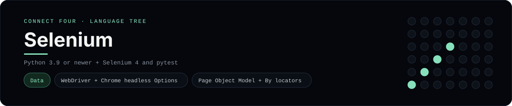

# Selenium Implementation

An end-to-end test suite that drives the Connect Four UI in a real browser with
Selenium WebDriver - a [framework showcase](../../README.md) alongside the
console implementations in [`languages/`](../../languages). Selenium automates
browsers through its WebDriver protocol, so this project asserts on the rendered
page instead of the byte-for-byte stdin/stdout console protocol, and the
dashboard shows one representative file from it rather than a single source file.

## Prerequisites

* **Toolchain:** Python 3.9 or newer with Selenium and pytest, plus Chrome
  (Selenium Manager fetches the matching driver automatically)
* **Check it is installed:** `python --version` and `python -c "import selenium"`

| Platform | Install command |
| --- | --- |
| Windows | `pip install selenium pytest` |
| macOS | `pip install selenium pytest` |
| Debian/Ubuntu | `pip install selenium pytest` |

## How to run

Everything the project needs is under `frameworks/selenium/`; run it from that
folder against the app (the same Vite app the preact/react examples serve):

```sh
cd frameworks/selenium
pip install -r requirements.txt
pytest
```

Set `BASE_URL` to point at another deployment, or `HEADLESS=0` to watch the
browser. The suite plays full games and checks the win, tie and reset states.

## How the tests are built

* **Page Object** - `pages/connect_four_page.py` is the Page Object Model: it
  owns the locators (`By.CSS_SELECTOR`), exposes `open`, `play`, `play_all`,
  `reset`, `status` and `column_is_disabled`, and keeps the tests free of
  selector noise.
* **Fixtures** - `conftest.py` builds a Chrome `Options` object (headless by
  default), yields a driver per test and quits it afterwards, and provides the
  `base_url` from the environment.
* **Tests** - `tests/test_connect_four.py` asserts the opening status, a
  horizontal win for `X`, a vertical win for `O`, a disabled full column and the
  reset button.

## Skills demonstrated

* Selenium WebDriver with Chrome `Options` (headless) and a driver fixture
* The Page Object Model and `By.*` locators
* pytest fixtures (`scope="session"`) with setup/teardown via `yield`
* End-to-end win/tie/reset assertions on real UI state

## Where the full app lives

The dashboard shows the spec, `tests/test_connect_four.py`, and links the whole
folder on GitHub. Everything the project needs is under
`frameworks/selenium/`:

```
frameworks/selenium/
  pages/connect_four_page.py
  tests/test_connect_four.py
  conftest.py
  pytest.ini
  requirements.txt
```

The showcase dashboard shows this framework's representative file when you
open the **Frameworks** browse mode, addressable at
`index.html?lang=selenium`.
