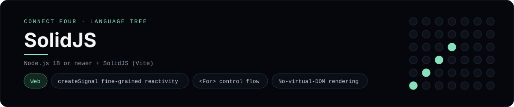

# SolidJS Implementation

A small SolidJS app that plays Connect Four in the browser - a
[framework showcase](../../README.md) alongside the console implementations in
[`languages/`](../../languages). SolidJS is a reactive UI library, so this app
renders components in the browser instead of the byte-for-byte stdin/stdout
console protocol, and the dashboard shows one representative file from it
rather than a single source file.

## Prerequisites

* **Toolchain:** Node.js 18 or newer
* **Check it is installed:** `node --version`

| Platform | Install command |
| --- | --- |
| Windows | `winget install OpenJS.NodeJS` |
| macOS | `brew install node` |
| Debian/Ubuntu | `apt-get install nodejs` |

## How to run

Everything the app needs is under `frameworks/solidjs/`; run it from that folder:

```sh
cd frameworks/solidjs
npm install
npm run dev
```

Then open the printed <http://localhost:5173> and play - the board is a 6x7
grid whose bottom row is the first to fill, and the first player to line up
four `X`s or `O`s wins.

## How the game is built

* **Board** - `src/board.js` is plain JavaScript with the 6x7 rules: `drop`,
  `isColumnFull`, `winner` and `lowestEmptyRow`. Every update returns a fresh
  board, and both diagonals are checked from every cell, matching the win
  detection the console implementations use.
* **Component** - `src/ConnectFour.jsx` holds the board and move count in
  `createSignal`, renders the grid with `<For>`, and derives the winner, "tie"
  and "whose turn" status through getter functions so Solid tracks them.
* **Entry** - `src/index.jsx` mounts the component with `render`, and
  `index.html` is the Vite root page.

## Skills demonstrated

* Fine-grained reactivity with `createSignal` and getter functions
* The `<For>` control-flow component and JSX list rendering
* Immutable updates without a virtual DOM
* An array-of-arrays board with diagonal win detection

## Where the full app lives

The dashboard shows the component, `src/ConnectFour.jsx`, and links the whole
folder on GitHub. Everything the app needs is under `frameworks/solidjs/`:

```
frameworks/solidjs/
  src/board.js
  src/ConnectFour.jsx
  src/index.jsx
  index.html
  vite.config.js
  package.json
```

The showcase dashboard shows this framework's representative file when you
open the **Frameworks** browse mode, addressable at `index.html?lang=solidjs`.
