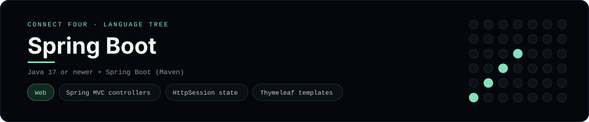

# Spring Boot Implementation

A small Spring Boot app that plays Connect Four in the browser - a
[framework showcase](../../README.md) alongside the console implementations in
[`languages/`](../../languages). Spring Boot is a web framework (it is one
project - "Spring" is the umbrella, "Spring Boot" the autoconfigured starter),
so this app serves HTML instead of the byte-for-byte stdin/stdout console
protocol, and the dashboard shows one representative file from it rather than a
single source file.

## Prerequisites

* **Toolchain:** Java 17 or newer (Spring Boot 3 needs it) and Maven
* **Check it is installed:** `java -version` and `mvn -version`

| Platform | Install command |
| --- | --- |
| Windows | `winget install Microsoft.OpenJDK.21` |
| macOS | `brew install openjdk` |
| Debian/Ubuntu | `apt-get install default-jdk maven` |

## How to run

The folder is a complete Maven project (`pom.xml` pulls in Spring Web and
Thymeleaf through the Spring Boot parent):

```sh
cd frameworks/springboot
mvn spring-boot:run
```

Then open <http://localhost:8080> and play - the board is a 6x7 grid whose
bottom row is the first to fill, and the first player to line up four `X`s or
`O`s wins.

## How the game is built

* **Board** - `src/main/java/com/example/connectfour/ConnectFourBoard.java`
  holds the 6x7 board and the rules: `drop`, `isFull`, `winner`, `isOver` and
  `hasLine`. Both diagonals are checked from every cell, matching the win
  detection the console implementations use.
* **Controller** - `.../GameController.java` keeps the board in the
  `HttpSession`, validates the chosen column, applies the move and redirects
  back (post/redirect/get), so a refresh never re-plays a move.
* **Application** - `.../ConnectFourApplication.java` is the
  `@SpringBootApplication` entry point.
* **Template** - `src/main/resources/templates/board.html` is a Thymeleaf
  template that renders the board (top row first) and a row of column buttons.

## Skills demonstrated

* Spring MVC `@Controller` with `@GetMapping` / `@PostMapping`
* `HttpSession` for game state and post/redirect/get
* Thymeleaf `th:each` and `#numbers.sequence`
* An array-of-arrays board with diagonal win detection

## Where the full app lives

The dashboard shows the controller,
`src/main/java/com/example/connectfour/GameController.java`, and links the whole
folder on GitHub. Everything the app needs is under `frameworks/springboot/`:

```
frameworks/springboot/
  pom.xml
  src/main/java/com/example/connectfour/ConnectFourBoard.java
  src/main/java/com/example/connectfour/GameController.java
  src/main/java/com/example/connectfour/ConnectFourApplication.java
  src/main/resources/templates/board.html
```

The showcase dashboard shows this framework's representative file when you
open the **Frameworks** browse mode, addressable at `index.html?lang=springboot`.
