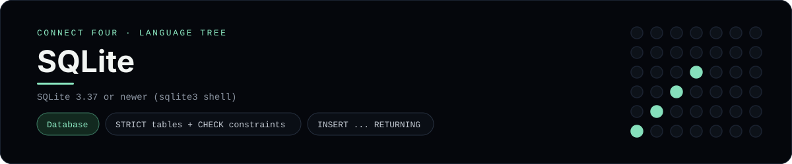

# SQLite Implementation

A pure-SQLite schema and query set for Connect Four - a
[framework showcase](../../README.md) alongside the console implementations in
[`languages/`](../../languages). SQLite is an embedded relational database, so it
answers with result sets instead of the byte-for-byte stdin/stdout console
protocol, and the dashboard shows one representative file from it rather than a
single source file.

## Prerequisites

* **Toolchain:** SQLite 3.37 or newer (for `STRICT` tables) with the `sqlite3`
  shell
* **Check it is installed:** `sqlite3 --version`

| Platform | Install command |
| --- | --- |
| Windows | `winget install SQLite.SQLite` |
| macOS | `brew install sqlite` |
| Debian/Ubuntu | `apt-get install sqlite3` |

## How to run

Everything the app needs is under `frameworks/sqlite/`; run it from that folder:

```sh
cd frameworks/sqlite
sqlite3 connect_four.db < schema.sql
sqlite3 connect_four.db < seed.sql
sqlite3 connect_four.db < queries.sql
```

The seed plays a horizontal win for `X` in the bottom row, so `queries.sql`
prints the rendered board.

## How the game is built

* **Schema** - `schema.sql` models a game as a `games` row plus one `moves` row
  per turn, using `STRICT` tables, CHECK constraints, a composite index and a
  `cells` view that numbers each disc with `ROW_NUMBER() OVER (...)`.
* **Seed** - `seed.sql` inserts the game with `INSERT ... RETURNING` and drops
  seven discs.
* **Queries** - `queries.sql` renders the board with a **recursive CTE** plus a
  `VALUES` column list left-joined onto the `cells` view, collapses each column
  with `json_group_array`, and shows the `HAVING` guard that detects a full
  column.

## Skills demonstrated

* `STRICT` tables, CHECK constraints and index design
* `INSERT ... RETURNING` and window functions
* Recursive CTEs and `VALUES`-list joins to build a grid
* `json_group_array` for per-column state

## Where the full app lives

The dashboard shows the schema, `schema.sql`, and links the whole folder on
GitHub. Everything the app needs is under `frameworks/sqlite/`:

```
frameworks/sqlite/
  schema.sql
  seed.sql
  queries.sql
```

The showcase dashboard shows this framework's representative file when you
open the **Frameworks** browse mode, addressable at `index.html?lang=sqlite`.
