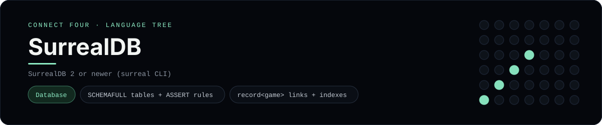

# SurrealDB Implementation

A SurrealQL schema and query set that models Connect Four with record links - a
[framework showcase](../../README.md) alongside the console implementations in
[`languages/`](../../languages). SurrealDB is a multi-model database, so it
answers with result sets instead of the byte-for-byte stdin/stdout console
protocol, and the dashboard shows one representative file from it rather than a
single source file.

## Prerequisites

* **Toolchain:** SurrealDB 2 or newer (the `surreal` CLI or `surreal start`)
* **Check it is installed:** `surreal version`

| Platform | Install command |
| --- | --- |
| Windows | `winget install SurrealDB.SurrealDB` |
| macOS | `brew install surrealdb/tap/surreal` |
| Debian/Ubuntu | run the official install script (see surrealdb.com/docs) |

## How to run

Everything the app needs is under `frameworks/surrealdb/`; start a server and
import the scripts:

```sh
cd frameworks/surrealdb
surreal start --user root --pass root memory
surreal import --conn http://localhost:8000 --user root --pass root --ns test --db test schema.surql
surreal sql --conn http://localhost:8000 --user root --pass root --ns test --db test --pretty < queries.surql
```

`queries.surql` starts a game, drops a winning line for `X`, reads the move log
and closes the game.

## How the game is built

* **Schema** - `schema.surql` defines `SCHEMAFULL` tables with typed fields,
  defaults and `ASSERT` validation, a typed `record<game>` link from each move
  back to its game, and a unique index on `(game, turn_no)`.
* **Queries** - `queries.surql` uses `LET` parameters, `CREATE ONLY` to return
  the new game, `CREATE` for the moves, `SELECT ... WHERE game = $game ORDER BY
  turn_no` for the log, `GROUP BY` for the per-column height, `UPDATE` to set the
  status and a `LIVE SELECT` subscriber.

## Skills demonstrated

* `DEFINE TABLE`/`DEFINE FIELD` with `SCHEMAFULL` and `ASSERT` rules
* Record links (`record<game>`) instead of foreign keys
* `LET` variables, `CREATE ONLY` and record ids
* Grouped aggregation and live queries

## Where the full app lives

The dashboard shows the schema, `schema.surql`, and links the whole folder on
GitHub. Everything the app needs is under `frameworks/surrealdb/`:

```
frameworks/surrealdb/
  schema.surql
  queries.surql
```

The showcase dashboard shows this framework's representative file when you
open the **Frameworks** browse mode, addressable at
`index.html?lang=surrealdb`.
