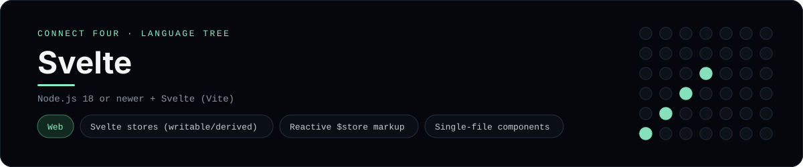

# Svelte Implementation

A small Svelte app that plays Connect Four in the browser - a
[framework showcase](../../README.md) alongside the console implementations in
[`languages/`](../../languages). Svelte is a UI framework, so this app compiles
its components in the browser instead of the byte-for-byte stdin/stdout console
protocol, and the dashboard shows one representative file from it rather than a
single source file.

## Prerequisites

* **Toolchain:** Node.js 18 or newer
* **Check it is installed:** `node --version`

| Platform | Install command |
| --- | --- |
| Windows | `winget install OpenJS.NodeJS` |
| macOS | `brew install node` |
| Debian/Ubuntu | `apt-get install nodejs` |

## How to run

Everything the app needs is under `frameworks/svelte/`; run it from that folder:

```sh
cd frameworks/svelte
npm install
npm install svelte
npm install -D vite @sveltejs/vite-plugin-svelte
npx vite
```

Then open the printed <http://localhost:5173> and play - the board is a 6x7
grid whose bottom row is the first to fill, and the first player to line up
four `X`s or `O`s wins.

## How the game is built

* **Board** - `src/lib/board.js` is plain JavaScript with the 6x7 rules: `drop`,
  `isColumnFull`, `winner` and `lowestEmptyRow`. Every update returns a fresh
  board, and both diagonals are checked from every cell, matching the win
  detection the console implementations use.
* **Stores** - `src/lib/store.js` is the reactive state: a `writable` game store
  plus `derived` stores for the board, the status, the winner and the "over"
  flag, with `play` / `reset` actions.
* **Component** - `src/App.svelte` is a single-file component that subscribes to
  the stores (`$status`, `$board`) and renders the grid and column buttons with
  `{#each}` and `on:click`.
* **Entry** - `src/main.js` mounts the component with `mount`, and `index.html`
  is the Vite root page.

## Skills demonstrated

* Svelte `writable` / `derived` stores
* Reactive `$store` subscriptions in markup
* Single-file components with `{#each}` and event directives
* An array-of-arrays board with diagonal win detection

## Where the full app lives

The dashboard shows the stores, `src/lib/store.js`, and links the whole folder
on GitHub. (The panel highlights the store rather than the `.svelte` file
because Prism, the dashboard's highlighter, ships no Svelte grammar - the
single-file component is still in the folder on GitHub.) Everything the app
needs is under `frameworks/svelte/`:

```
frameworks/svelte/
  src/lib/board.js
  src/lib/store.js
  src/App.svelte
  src/main.js
  index.html
```

The showcase dashboard shows this framework's representative file when you
open the **Frameworks** browse mode, addressable at `index.html?lang=svelte`.
