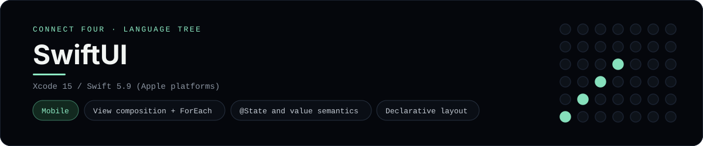

# SwiftUI Implementation

A small SwiftUI app that plays Connect Four on Apple platforms - a
[framework showcase](../../README.md) alongside the console implementations in
[`languages/`](../../languages). SwiftUI is Apple's declarative UI framework, so
this app draws native views instead of the byte-for-byte stdin/stdout console
protocol, and the dashboard shows one representative file from it rather than a
single source file.

## Prerequisites

* **Toolchain:** Xcode 15 or newer (Swift 5.9) on macOS
* **Check it is installed:** `swift --version`

| Platform | Install command |
| --- | --- |
| Windows | not supported (build on macOS) |
| macOS | `xcode-select --install` |
| Linux | not supported (SwiftUI is Apple-only) |

## How to run

Everything the app needs is under `frameworks/swiftui/`. On a Mac, create an
Xcode app project and drag the three files in `Sources/ConnectFour/` into it, or
open the folder in Xcode:

```sh
cd frameworks/swiftui
xed .
```

Then press Run and play - the board is a 6x7 grid whose bottom row is the first
to fill, and the first player to line up four discs wins.

## How the game is built

* **Board** - `Sources/ConnectFour/Board.swift` is a `ConnectFourBoard` struct
  with the 6x7 rules: `play`, `isFull`, `winner` and `lowestEmptyRow`. Both
  diagonals are checked from every cell, matching the win detection the console
  implementations use.
* **View** - `Sources/ConnectFour/ContentView.swift` holds the board in `@State`,
  renders the discs with nested `ForEach` loops, and derives the status line on
  every render.
* **App** - `Sources/ConnectFour/ConnectFourApp.swift` is the `@main` entry that
  opens the window scene.

## Skills demonstrated

* SwiftUI `View` composition with `VStack`/`HStack` and `ForEach`
* Swift value semantics and `@State`
* Declarative layout and conditional modifiers
* A struct board with diagonal win detection

## Where the full app lives

The dashboard shows the view, `Sources/ConnectFour/ContentView.swift`, and links
the whole folder on GitHub. Everything the app needs is under
`frameworks/swiftui/`:

```
frameworks/swiftui/
  Sources/ConnectFour/Board.swift
  Sources/ConnectFour/ContentView.swift
  Sources/ConnectFour/ConnectFourApp.swift
```

The showcase dashboard shows this framework's representative file when you
open the **Frameworks** browse mode, addressable at `index.html?lang=swiftui`.
