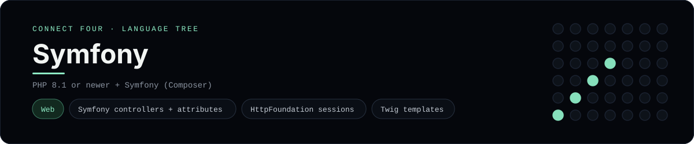

# Symfony Implementation

A small Symfony app that plays Connect Four in the browser - a
[framework showcase](../../README.md) alongside the console implementations in
[`languages/`](../../languages). Symfony is a web framework, so this app serves
server-rendered Twig views instead of the byte-for-byte stdin/stdout console
protocol, and the dashboard shows one representative file from it rather than a
single source file.

## Prerequisites

* **Toolchain:** PHP 8.1 or newer, Composer, and the Symfony CLI (optional)
* **Check it is installed:** `php -v` and `composer --version`

| Platform | Install command |
| --- | --- |
| Windows | `composer global require symfony/cli` (or download `symfony.exe`) |
| macOS | `brew install symfony-cli/tap/symfony-cli` |
| Debian/Ubuntu | install the Symfony CLI from the symfony.com installer |

## How to run

Generate a Symfony project and drop the app files into it (the app is a slice,
so the scaffolding comes from the CLI):

```sh
symfony new connectfour --webapp
cp frameworks/symfony/src/Game/. connectfour/src/Game/ -r
cp frameworks/symfony/src/Controller/GameController.php connectfour/src/Controller/
cp frameworks/symfony/templates/game/. connectfour/templates/game/ -r
cp frameworks/symfony/config/routes.yaml connectfour/config/routes.yaml
cd connectfour && symfony server:start
```

Then open the printed address and play - the board is a 6x7 grid whose bottom
row is the first to fill, and the first player to line up four `X`s or `O`s
wins.

## How the game is built

* **Board** - `src/Game/ConnectFourBoard.php` holds the 6x7 board and the
  rules: `drop`, `isFull`, `winner`, `isOver` and `hasLine`, plus `fromArray` /
  `toArray` so it can round-trip through the session. Both diagonals are checked
  from every cell, matching the win detection the console implementations use.
* **Controller** - `src/Controller/GameController.php` keeps the board in the
  `HttpFoundation` session, validates the chosen column, applies the move and
  redirects back (post/redirect/get), so a refresh never re-plays a move. Its
  routes are declared with `#[Route]` attributes.
* **Template** - `templates/game/board.html.twig` renders the board (top row
  first) and the column buttons with `path()`-generated form actions.
* **Routes** - `config/routes.yaml` imports the attribute routes from
  `src/Controller/`.

## Skills demonstrated

* Symfony controllers and attribute routes (`#[Route]`)
* HttpFoundation `Request` / `Session` and post/redirect/get
* Twig templates with `path()` and filters
* An array-of-arrays board with diagonal win detection

## Where the full app lives

The dashboard shows the controller, `src/Controller/GameController.php`, and
links the whole folder on GitHub. Everything the app adds is under
`frameworks/symfony/`:

```
frameworks/symfony/
  src/Game/ConnectFourBoard.php
  src/Controller/GameController.php
  templates/game/board.html.twig
  config/routes.yaml
```

The showcase dashboard shows this framework's representative file when you
open the **Frameworks** browse mode, addressable at `index.html?lang=symfony`.
