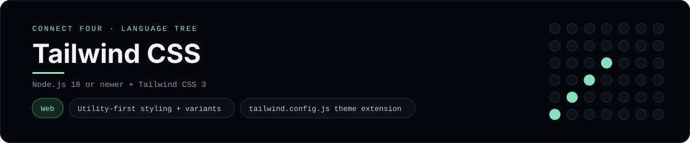

# Tailwind CSS Implementation

A small Tailwind CSS page that plays Connect Four in the browser - a
[framework showcase](../../README.md) alongside the console implementations in
[`languages/`](../../languages). Tailwind is a utility-first CSS framework, so
this app styles a static HTML page instead of the byte-for-byte stdin/stdout
console protocol, and the dashboard shows one representative file from it
rather than a single source file.

## Prerequisites

* **Toolchain:** Node.js 18 or newer
* **Check it is installed:** `node --version`

| Platform | Install command |
| --- | --- |
| Windows | `winget install OpenJS.NodeJS` |
| macOS | `brew install node` |
| Debian/Ubuntu | `apt-get install nodejs` |

## How to run

Everything the app needs is under `frameworks/tailwindcss/`; run it from that
folder:

```sh
cd frameworks/tailwindcss
npm install
npm run build
```

Then serve the folder (for example `npx serve`) and open `index.html` - the
board is a 6x7 grid whose bottom row is the first to fill, and the first player
to line up four discs wins. `npm run watch` rebuilds the CSS on every change.

## How the game is built

* **Markup** - `index.html` styles the whole page - the navy canvas, the blue
  board, the red/yellow discs and the column buttons - with utility classes
  only, plus a custom `mint` colour from the theme extension.
* **Theme** - `tailwind.config.js` extends the palette with the project's mint
  accent and points `content` at the markup and scripts so unused classes are
  purged from the build.
* **Stylesheet** - `src/input.css` pulls in `@tailwind base/components/utilities`
  and adds a `.board-disc` component class for the repeated disc shape.
* **Logic** - `src/game.js` is plain ES-module JavaScript that owns the board
  and paints the discs with the same utility classes.

## Skills demonstrated

* Utility-first styling with responsive, state (`hover:`/`active:`/`disabled:`)
  and layout (`grid`, `flex`) variants
* A `tailwind.config.js` theme extension and a component layer
* Purging-driven production builds with the Tailwind CLI
* An array-of-arrays board with diagonal win detection

## Where the full app lives

The dashboard shows the page, `index.html`, and links the whole folder on
GitHub. Everything the app needs is under `frameworks/tailwindcss/`:

```
frameworks/tailwindcss/
  index.html
  src/input.css
  src/game.js
  src/board.js
  tailwind.config.js
  package.json
```

The showcase dashboard shows this framework's representative file when you
open the **Frameworks** browse mode, addressable at `index.html?lang=tailwindcss`.
