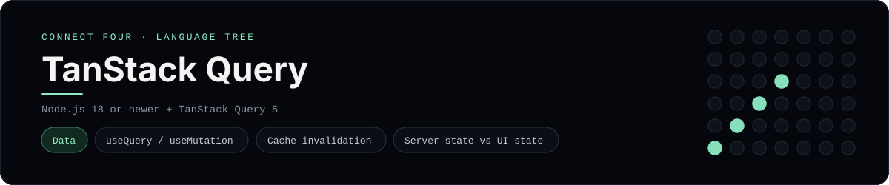

# TanStack Query Implementation

A small React app that plays Connect Four against a JSON API using TanStack
Query - a [framework showcase](../../README.md) alongside the console
implementations in [`languages/`](../../languages). TanStack Query is the data
layer for React, so this app fetches and mutates server state instead of using
the byte-for-byte stdin/stdout console protocol, and the dashboard shows one
representative file from it rather than a single source file.

## Prerequisites

* **Toolchain:** Node.js 18 or newer
* **Check it is installed:** `node --version`

| Platform | Install command |
| --- | --- |
| Windows | `winget install OpenJS.NodeJS` |
| macOS | `brew install node` |
| Debian/Ubuntu | `apt-get install nodejs` |

## How to run

Everything the app needs is under `frameworks/tanstackquery/`; run it from that
folder:

```sh
cd frameworks/tanstackquery
npm install
npm run server
npm run client
```

The JSON API listens on <http://localhost:3001> and the Vite page on
<http://localhost:5173> - the board is a 6x7 grid whose bottom row is the first
to fill, and the first player to line up four `X`s or `O`s wins.

## How the game is built

* **Board** - `server/board.js` is the 6x7 rules engine: `drop`, `isColumnFull`,
  `winner` and `lowestEmptyRow`, with both diagonals checked from every cell.
* **API** - `server/index.js` is a tiny `node:http` server exposing `GET /api/game`
  and `POST /api/move` / `POST /api/reset`, keyed by a cookie.
* **Client** - `src/ConnectFour.jsx` uses `useQuery` for the board and
  `useMutation` for moves, invalidating the query on success; `src/api.js`
  wraps `fetch`.

## Skills demonstrated

* TanStack Query `useQuery` / `useMutation` and cache invalidation
* A typed-ish API client over `fetch`
* Server state kept separate from UI state
* An array-of-arrays board with diagonal win detection

## Where the full app lives

The dashboard shows the component, `src/ConnectFour.jsx`, and links the whole
folder on GitHub. Everything the app needs is under
`frameworks/tanstackquery/`:

```
frameworks/tanstackquery/
  server/board.js
  server/index.js
  src/api.js
  src/ConnectFour.jsx
  src/main.jsx
  package.json
```

The showcase dashboard shows this framework's representative file when you
open the **Frameworks** browse mode, addressable at
`index.html?lang=tanstackquery`.
