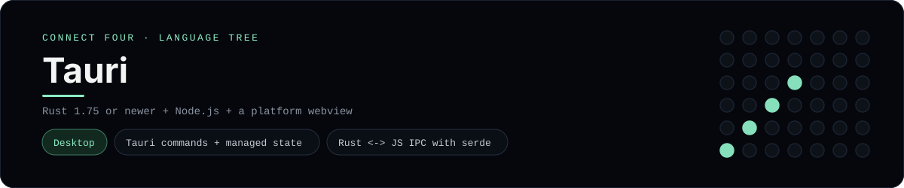

# Tauri Implementation

A small Tauri app that plays Connect Four as a lightweight desktop window - a
[framework showcase](../../README.md) alongside the console implementations in
[`languages/`](../../languages). Tauri pairs a Rust backend with a web frontend,
so this app calls into Rust instead of the byte-for-byte stdin/stdout console
protocol, and the dashboard shows one representative file from it rather than a
single source file.

## Prerequisites

* **Toolchain:** Rust 1.75 or newer + Node.js 18 or newer (plus the platform's
  webview: WebView2 on Windows, WebKitGTK on Linux)
* **Check it is installed:** `cargo --version` and `node --version`

| Platform | Install command |
| --- | --- |
| Windows | `winget install Rustlang.Rustup OpenJS.NodeJS` |
| macOS | `brew install rust node` |
| Debian/Ubuntu | `apt-get install cargo nodejs` |

## How to run

Everything the app needs is under `frameworks/tauri/`; run it from that folder:

```sh
cd frameworks/tauri
npm install
npm run dev
```

A desktop window opens - the board is a 6x7 grid whose bottom row is the first
to fill, and the first player to line up four `X`s or `O`s wins.

## How the game is built

* **Rust** - `src-tauri/src/board.rs` holds the 6x7 rules: `drop`, `is_full`,
  `winner` and `lowest_empty_row`. Both diagonals are checked from every cell,
  matching the win detection the console implementations use.
* **Commands** - `src-tauri/src/main.rs` keeps the board in a managed
  `Mutex<ConnectFourBoard>` and exposes `new_game` and `play` as
  `#[tauri::command]`s that return a serialisable `GameView`.
* **Frontend** - `src/main.js` renders the grid and calls the commands with
  `invoke`, so all game logic stays in Rust.

## Skills demonstrated

* Tauri commands and managed state
* Rust + web frontend IPC with `serde` serialisation
* A small, dependency-light desktop app
* A `Vec<Vec<String>>` board with diagonal win detection

## Where the full app lives

The dashboard shows the Rust entry point, `src-tauri/src/main.rs`, and links the
whole folder on GitHub. Everything the app needs is under `frameworks/tauri/`:

```
frameworks/tauri/
  src/main.js
  src/index.html
  src-tauri/src/board.rs
  src-tauri/src/main.rs
  src-tauri/Cargo.toml
  src-tauri/tauri.conf.json
  package.json
```

The showcase dashboard shows this framework's representative file when you
open the **Frameworks** browse mode, addressable at `index.html?lang=tauri`.
