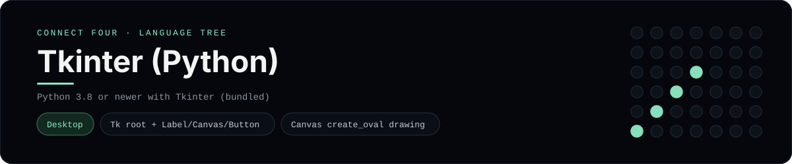

# Tkinter (Python) Implementation

A desktop Connect Four built with **Tkinter**, Python's standard GUI toolkit:
`app.py` draws the board on a `Canvas` and drops red and yellow discs where you
click, and `board.py` holds the 6x7 rules. It is a
[framework showcase](../../README.md) rather than a console language, so the
dashboard shows one representative file from it (the window) and links the whole
folder on GitHub.

## Prerequisites

* **Toolchain:** Python 3.8 or newer with Tkinter (bundled with the official
  Python builds)
* **Check it is installed:** `python -c "import tkinter"`

| Platform | Install command |
| --- | --- |
| Windows | `winget install Python.Python.3.12` (Tkinter included) |
| macOS | `brew install python-tk` |
| Debian/Ubuntu | `apt-get install python3-tk` |

## How to run

From `frameworks/tkinter/`:

```sh
cd frameworks/tkinter
python app.py
```

A window opens on a 6x7 board; click any column to drop a disc, and the first
player to line up four red or yellow discs wins. **New game** clears the board.

## How the game is built

* **Window** - `app.py` is the GUI: a status `Label`, a `Canvas` sized to the
  board, a **New game** `Button`, and a `mainloop`. A click is turned into a
  column with `event.x // CELL`, and every change calls `refresh`, which redraws
  each slot as an oval filled with the disc colour (or the empty-slot colour).
* **Board** - `board.py` is the 6x7 position: `drop`, `is_full`, `winner` and
  `current_player`. Both diagonals are checked from every cell, matching the win
  detection the console implementations use.

## Skills demonstrated

* A Tkinter `Tk` root with `Label`, `Canvas` and `Button` widgets
* Canvas drawing (`create_oval`) and rebinding click events
* A board model kept separate from the view

## Where the full project lives

The dashboard shows the window, `app.py`, and links the whole folder on GitHub.
Everything the app needs is under `frameworks/tkinter/`:

```
frameworks/tkinter/
  app.py
  board.py
```

The showcase dashboard shows this framework's representative file when you
open the **Frameworks** browse mode, addressable at `index.html?lang=tkinter`.
