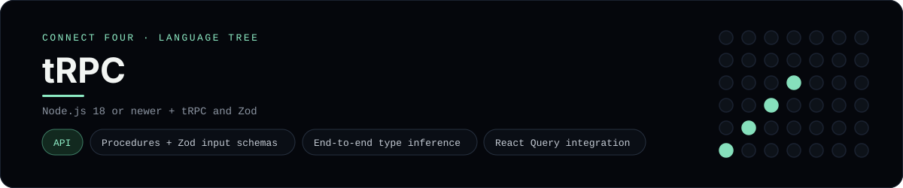

# tRPC Implementation

A small tRPC app that plays Connect Four in the browser - a
[framework showcase](../../README.md) alongside the console implementations in
[`languages/`](../../languages). tRPC gives end-to-end type safety between a
TypeScript server and client, so this app talks to a typed API instead of the
byte-for-byte stdin/stdout console protocol, and the dashboard shows one
representative file from it rather than a single source file.

## Prerequisites

* **Toolchain:** Node.js 18 or newer
* **Check it is installed:** `node --version`

| Platform | Install command |
| --- | --- |
| Windows | `winget install OpenJS.NodeJS` |
| macOS | `brew install node` |
| Debian/Ubuntu | `apt-get install nodejs` |

## How to run

Everything the app needs is under `frameworks/trpc/`; run the server from that
folder:

```sh
cd frameworks/trpc
npm install
npm run server
```

The typed API listens on <http://localhost:3000>; run `npm run client` for the
Vite page. The board is a 6x7 grid whose bottom row is the first to fill, and
the first player to line up four `X`s or `O`s wins.

## How the game is built

* **Board** - `server/board.ts` is a `ConnectFourBoard` class with the 6x7
  rules: `play`, `isFull`, `winner` and `lowestEmptyRow`. Both diagonals are
  checked from every cell, matching the win detection the console
  implementations use.
* **Router** - `server/router.ts` defines three procedures (`board`, `move` and
  `reset`) with a Zod input schema, exported as an `AppRouter` type the client
  imports directly - so a wrong input is a compile error.
* **Client** - `client/App.tsx` calls the procedures with the tRPC proxy client
  and TanStack Query.

## Skills demonstrated

* tRPC procedures, context and Zod input validation
* End-to-end type inference from `AppRouter`
* React Query mutations and cache invalidation
* A class-based board with diagonal win detection

## Where the full app lives

The dashboard shows the router, `server/router.ts`, and links the whole folder
on GitHub. Everything the app needs is under `frameworks/trpc/`:

```
frameworks/trpc/
  server/board.ts
  server/router.ts
  server/index.ts
  client/App.tsx
  package.json
```

The showcase dashboard shows this framework's representative file when you
open the **Frameworks** browse mode, addressable at `index.html?lang=trpc`.
