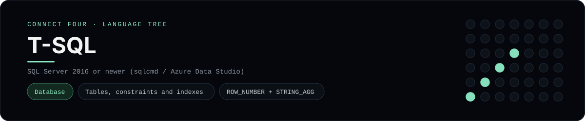

# T-SQL Implementation

A pure T-SQL Connect Four that stores games in SQL Server and computes the board
and winner in the database - a [framework showcase](../../README.md) alongside
the console implementations in [`languages/`](../../languages). T-SQL is a
database dialect rather than a console program, so it serves result sets instead
of the byte-for-byte stdin/stdout protocol, and the dashboard shows one
representative file from it rather than a single source file.

## Prerequisites

* **Toolchain:** SQL Server 2016 or newer (or Azure SQL) with a client such as
  `sqlcmd` or Azure Data Studio
* **Check it is installed:** `sqlcmd -?`

| Platform | Install command |
| --- | --- |
| Windows | `winget install Microsoft.SQLServer.2022.Developer` (or use a container) |
| macOS | SQL Server in Docker + `brew install sqlcmd` |
| Debian/Ubuntu | SQL Server in Docker + `apt-get install mssql-tools` |

## How to run

Everything the app needs is under `frameworks/tsql/`; run the scripts against a
database:

```sh
cd frameworks/tsql
sqlcmd -S localhost -i schema.sql
sqlcmd -S localhost -i procedures.sql
sqlcmd -S localhost -i seed.sql
```

The seed plays a horizontal win for `X`, so the final batch prints the board and
`fn_Winner(1)` returns `X`.

## How the game is built

* **Schema** - `schema.sql` normalises a game into a `Games` row plus one `Moves`
  row per turn, with CHECK constraints, a unique `(GameId, TurnNo)` and a
  `dbo.Cells` view that numbers each disc's row with
  `ROW_NUMBER() OVER (PARTITION BY GameId, ColumnNo ORDER BY TurnNo)`.
* **Functions** - `procedures.sql` adds `dbo.fn_Board` (a `STRING_AGG` grid),
  `dbo.fn_Winner` (a self-join across all four directions) and the
  `dbo.DropDisc` procedure, which validates the column and `THROW`s a custom
  error when it is out of range or full.
* **Seed** - `seed.sql` plays a short game through the procedure so the
  functions return something immediately.

## Skills demonstrated

* Tables, CHECK constraints, unique keys and indexes
* `ROW_NUMBER() OVER (PARTITION BY ...)` and `STRING_AGG ... WITHIN GROUP`
* Sets of values, table-valued functions and `CROSS JOIN`
* Stored procedures with `THROW` error handling

## Where the full app lives

The dashboard shows the schema, `schema.sql`, and links the whole folder on
GitHub. Everything the app needs is under `frameworks/tsql/`:

```
frameworks/tsql/
  schema.sql
  procedures.sql
  seed.sql
```

The showcase dashboard shows this framework's representative file when you
open the **Frameworks** browse mode, addressable at `index.html?lang=tsql`.
