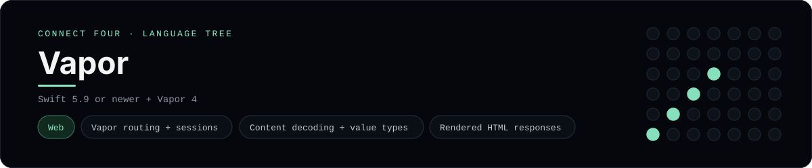

# Vapor Implementation

A small Vapor app that plays Connect Four in the browser - a
[framework showcase](../../README.md) alongside the console implementations in
[`languages/`](../../languages). Vapor is a Swift server framework, so this app
serves HTML instead of the byte-for-byte stdin/stdout console protocol, and the
dashboard shows one representative file from it rather than a single source
file.

## Prerequisites

* **Toolchain:** Swift 5.9 or newer
* **Check it is installed:** `swift --version`

| Platform | Install command |
| --- | --- |
| Windows | `winget install Swift.Toolchain` |
| macOS | `xcode-select --install` |
| Debian/Ubuntu | install the swift.org toolchain |

## How to run

Everything the app needs is under `frameworks/vapor/`; run it from that folder:

```sh
cd frameworks/vapor
swift run
```

Then open <http://localhost:8080> and play - the board is a 6x7 grid whose
bottom row is the first to fill, and the first player to line up four `X`s or
`O`s wins.

## How the game is built

* **Board** - `Sources/App/Board.swift` is a `ConnectFourBoard` struct with the
  6x7 rules: `drop`, `isFull`, `winner` and `lowestEmptyRow`. Both diagonals are
  checked from every cell, matching the win detection the console
  implementations use. It encodes itself to a string for the session.
* **Routes** - `Sources/App/routes.swift` handles `GET /`, `POST /move` and
  `POST /reset`, reading and writing the board through `req.session.data` and
  redirecting back (post/redirect/get).
* **Boot** - `Sources/App/configure.swift` adds the sessions middleware and
  `Sources/App/main.swift` starts the application.

## Skills demonstrated

* Vapor routing, sessions and `Content` decoding
* Swift value semantics (`mutating func`, `struct` state)
* Returning rendered HTML from an async route handler
* An array-of-arrays board with diagonal win detection

## Where the full app lives

The dashboard shows the routes, `Sources/App/routes.swift`, and links the whole
folder on GitHub. Everything the app needs is under `frameworks/vapor/`:

```
frameworks/vapor/
  Sources/App/Board.swift
  Sources/App/routes.swift
  Sources/App/configure.swift
  Sources/App/main.swift
  Package.swift
```

The showcase dashboard shows this framework's representative file when you
open the **Frameworks** browse mode, addressable at `index.html?lang=vapor`.
