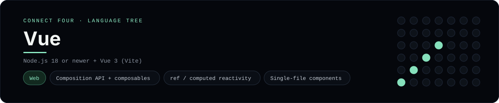

# Vue Implementation

A small Vue app that plays Connect Four in the browser - a
[framework showcase](../../README.md) alongside the console implementations in
[`languages/`](../../languages). Vue is a UI framework, so this app renders
components in the browser instead of the byte-for-byte stdin/stdout console
protocol, and the dashboard shows one representative file from it rather than a
single source file.

## Prerequisites

* **Toolchain:** Node.js 18 or newer
* **Check it is installed:** `node --version`

| Platform | Install command |
| --- | --- |
| Windows | `winget install OpenJS.NodeJS` |
| macOS | `brew install node` |
| Debian/Ubuntu | `apt-get install nodejs` |

## How to run

Everything the app needs is under `frameworks/vue/`; run it from that folder:

```sh
cd frameworks/vue
npm install
npm install vue
npm install -D vite @vitejs/plugin-vue
npx vite
```

Then open the printed <http://localhost:5173> and play - the board is a 6x7
grid whose bottom row is the first to fill, and the first player to line up
four `X`s or `O`s wins.

## How the game is built

* **Board** - `src/board.js` is plain JavaScript with the 6x7 rules: `drop`,
  `isColumnFull`, `winner` and `lowestEmptyRow`. Every update returns a fresh
  board, and both diagonals are checked from every cell, matching the win
  detection the console implementations use.
* **Composable** - `src/composables/useConnectFour.js` is the Composition API
  state: `ref` for the board and move count, `computed` for the status, winner
  and "over" flags, and `play` / `reset` actions.
* **Component** - `src/components/ConnectFour.vue` is a single-file component
  whose `<script setup>` binds the composable and whose `<template>` uses
  `v-for`, `:class` and `:disabled`.
* **Entry** - `src/main.js` mounts the app with `createApp`, and `index.html`
  is the Vite root page.

## Skills demonstrated

* Vue 3 Composition API and `ref` / `computed`
* Single-file components with `<script setup>`
* Template directives (`v-for`, `:class`, `:disabled`, `@click`)
* An array-of-arrays board with diagonal win detection

## Where the full app lives

The dashboard shows the composable, `src/composables/useConnectFour.js`, and
links the whole folder on GitHub. (The panel highlights the composable rather
than the `.vue` file because Prism, the dashboard's highlighter, ships no Vue
grammar - the single-file component is still in the folder on GitHub.) Everything
the app needs is under `frameworks/vue/`:

```
frameworks/vue/
  src/board.js
  src/composables/useConnectFour.js
  src/components/ConnectFour.vue
  src/main.js
  index.html
```

The showcase dashboard shows this framework's representative file when you
open the **Frameworks** browse mode, addressable at `index.html?lang=vue`.
