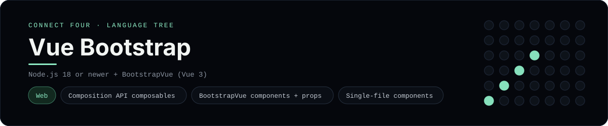

# Vue Bootstrap Implementation

A small Vue 3 app that plays Connect Four with BootstrapVue components - a
[framework showcase](../../README.md) alongside the console implementations in
[`languages/`](../../languages). BootstrapVue wraps Bootstrap's components as
Vue components (this app uses the Vue 3 line, BootstrapVueNext), so it renders
components in the browser instead of the byte-for-byte stdin/stdout console
protocol, and the dashboard shows one representative file from it rather than a
single source file.

## Prerequisites

* **Toolchain:** Node.js 18 or newer
* **Check it is installed:** `node --version`

| Platform | Install command |
| --- | --- |
| Windows | `winget install OpenJS.NodeJS` |
| macOS | `brew install node` |
| Debian/Ubuntu | `apt-get install nodejs` |

## How to run

Everything the app needs is under `frameworks/vuebootstrap/`; run it from that
folder:

```sh
cd frameworks/vuebootstrap
npm install
npm run dev
```

Then open the printed <http://localhost:5173> and play - the board is a 6x7 grid
whose bottom row is the first to fill, and the first player to line up four
`X`s or `O`s wins.

## How the game is built

* **Composable** - `src/composables/useConnectFour.js` is the Composition API
  composable: `ref` state, `computed` status/rows/columns/`alertVariant`, and
  `play`/`reset` actions. It is the representative file because Prism has no Vue
  grammar.
* **Component** - `src/App.vue` is a single-file component that composes the
  page from BootstrapVue components (`BContainer`, `BAlert`, `BBadge`, `BCard`,
  `BTable`, `BButtonGroup`, `BButton`) and renders the discs with Bootstrap
  utilities.
* **Board** - `src/board.js` is plain JavaScript with the 6x7 rules; both
  diagonals are checked from every cell, matching the console implementations.

## Skills demonstrated

* Composition API with `ref`/`computed` and reusable composables
* BootstrapVue components and props (`variant`, `:disabled`, `@click`)
* Single-file components with Bootstrap's dark theme
* An array-of-arrays board with diagonal win detection

## Where the full app lives

The dashboard shows the composable, `src/composables/useConnectFour.js`, and
links the whole folder on GitHub. Everything the app needs is under
`frameworks/vuebootstrap/`:

```
frameworks/vuebootstrap/
  src/board.js
  src/composables/useConnectFour.js
  src/App.vue
  src/main.js
  index.html
  vite.config.js
  package.json
```

The showcase dashboard shows this framework's representative file when you
open the **Frameworks** browse mode, addressable at
`index.html?lang=vuebootstrap`.
