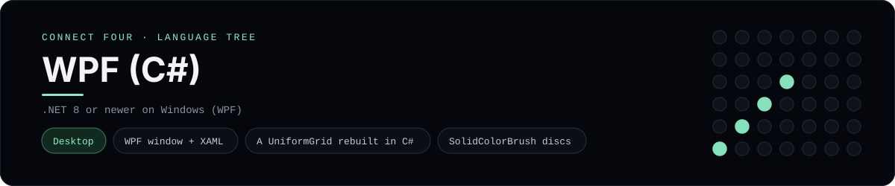

# WPF (C#) Implementation

A Windows desktop Connect Four built with **WPF** in C#: `MainWindow.xaml`
declares the view, `MainWindow.xaml.cs` renders the board and handles clicks,
and `Board.cs` holds the rules. It is a
[framework showcase](../../README.md) rather than a console language, so the
dashboard shows one representative file from it (the code-behind) and links the
whole folder on GitHub.

## Prerequisites

* **Toolchain:** the .NET SDK 8 or newer on Windows (WPF ships with it)
* **Check it is installed:** `dotnet --version`

| Platform | Install command |
| --- | --- |
| Windows | `winget install Microsoft.DotNet.SDK.8` |
| macOS | WPF is Windows-only |
| Debian/Ubuntu | WPF is Windows-only |

## How to run

The folder is a complete WPF project, so build and run it directly:

```sh
cd frameworks/wpf
dotnet run
```

A window opens on a 6x7 board; click a numbered button to drop a disc, and the
first player to line up four red or yellow discs wins. **New game** clears the
board.

## How the game is built

* **View** - `MainWindow.xaml` lays out the status `TextBlock`, a `UniformGrid`
  for the 6x7 board, a row of seven column `Button`s (each carrying its number
  in `Tag`) and a **New game** button.
* **Code-behind** - `MainWindow.xaml.cs` is the window logic: it turns a button
  press into a column, applies the move, and rebuilds the board's children as
  coloured `Border` ellipses on every change. It highlights this file because
  Prism, the dashboard's highlighter, ships no XAML grammar - the `.xaml` view is
  still in the folder on GitHub.
* **Board** - `Board.cs` holds the 6x7 board and the rules: `Drop`, `IsFull`,
  `Winner`, `IsOver` and `Matches`, with both diagonals checked from every cell.

## Skills demonstrated

* WPF windows, XAML layout and code-behind
* A `UniformGrid` board rebuilt from C#
* `Button.Tag` event plumbing and `SolidColorBrush` discs
* A 2D array board with diagonal win detection

## Where the full app lives

The dashboard shows the code-behind, `MainWindow.xaml.cs`, and links the whole
folder on GitHub. Everything the app needs is under `frameworks/wpf/`:

```
frameworks/wpf/
  App.xaml
  App.xaml.cs
  Board.cs
  ConnectFour.csproj
  MainWindow.xaml
  MainWindow.xaml.cs
```

The showcase dashboard shows this framework's representative file when you
open the **Frameworks** browse mode, addressable at `index.html?lang=wpf`.
