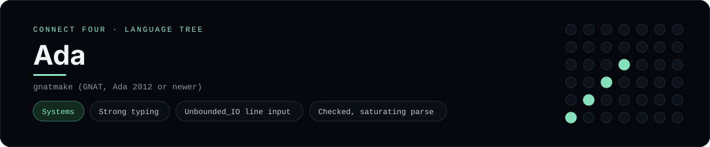

# Ada Implementation

Strong typing, unbounded-string line input and checked numeric conversion - one of 44 implementations of the same console protocol in the
[Neo-Connect-Four-Language-Tree](../../README.md) repository. Every
implementation reads the same stdin and prints byte-for-byte identical
output, so a single master test verifies them all at once.

## Prerequisites

* **Toolchain:** gnatmake (GNAT, Ada 2012 or newer)
* **Check it is installed:** `gnatmake --version`

| Platform | Install command |
| --- | --- |
| Windows | `pacman -S mingw-w64-x86_64-gcc-ada (MSYS2)` |
| macOS | `brew install gnat` |
| Debian/Ubuntu | `apt-get install gnat` |

## How to run

Build this implementation and replay every scenario (from the repository
root):

```sh
python tests/run_tests.py
```

Build and play it on its own:

```sh
gnatmake -O2 -D tests/build/ada -o tests/build/connect_four_ada languages/ada/connect_four.adb
./tests/build/connect_four_ada
```

### Notes

* On Windows the built program is `tests/build/connect_four_ada.exe`; on other platforms the `.exe` suffix is dropped.
* GNAT comes from MSYS2's `mingw-w64-x86_64-gcc-ada` package, which installs into `C:\msys64\mingw64\bin` - not on the default `PATH`. The runner adds it, and creates `tests/build/ada` because `gnatmake -D` will not create that directory itself.
* Input goes through `Ada.Text_IO.Unbounded_IO`, so a line can be any length and the CR of a CRLF pair is dropped; each prompt is flushed before the read, because Ada buffers `Standard_Output` when it is not a terminal.

## Skills demonstrated

* Strong typing
* Unbounded_IO line input
* Checked, saturating parse

## Verified output

The runner replays the eight scripted sessions in
[`tests/inputs/`](../../tests/inputs) and compares stdout with the goldens in
[`tests/expected/`](../../tests/expected) byte for byte. It then checks that
the prompt appears before each read while stdin is still open, which is what
separates an interactive program from one that swallows its input up front.
`languages/ada/connect_four.adb` is the only file this implementation needs.

## Protocol

[`README.md`](../../README.md#console-protocol) documents the console
protocol exactly, and [`tests/run_tests.py`](../../tests/run_tests.py) holds
the build and run commands the suite uses for every language. The showcase
dashboard shows this implementation at `index.html?lang=ada`.

This README and its banner are generated by
[`tools/generate_language_readmes.py`](../../tools/generate_language_readmes.py),
which reads the runner's own metadata - so re-run that script rather than
editing them by hand.
