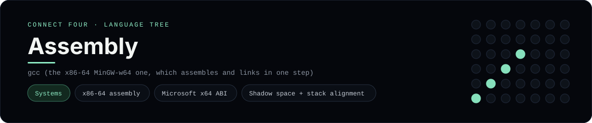

# Assembly Implementation

Win64 x86-64 assembly in GNU `as` syntax, on the Microsoft x64 ABI - one of 42 implementations of the same console protocol in the
[Neo-Connect-Four-Language-Tree](../../README.md) repository. Every
implementation reads the same stdin and prints byte-for-byte identical
output, so a single master test verifies them all at once.

## Prerequisites

* **Toolchain:** gcc (the x86-64 MinGW-w64 one, which assembles and links in one step)
* **Check it is installed:** `gcc --version`

| Platform | Install command |
| --- | --- |
| Windows | `winget install BrechtSanders.WinLibs.POSIX.UCRT (or MSYS2: pacman -S mingw-w64-ucrt-x86_64-gcc)` |
| macOS | `xcode-select --install` |
| Debian/Ubuntu | `apt-get install build-essential` |

## How to run

Build this implementation and replay every scenario (from the repository
root):

```sh
python tests/run_tests.py
```

Build and play it on its own:

```sh
gcc -o tests/build/connect_four_asm languages/assembly/connect_four.s
./tests/build/connect_four_asm
```

### Notes

* On Windows the built program is `tests/build/connect_four_asm.exe`; on other platforms the `.exe` suffix is dropped.
* Use the x86-64 MinGW-w64 `gcc`, not the 32-bit one GnuCOBOL ships; the runner selects that toolchain with `mingw64_env()`. Every call reserves 32 bytes of shadow space and keeps `rsp` 16-byte aligned.

## Skills demonstrated

* x86-64 assembly
* Microsoft x64 ABI
* Shadow space + stack alignment

## Verified output

The runner replays the eight scripted sessions in
[`tests/inputs/`](../../tests/inputs) and compares stdout with the goldens in
[`tests/expected/`](../../tests/expected) byte for byte. It then checks that
the prompt appears before each read while stdin is still open, which is what
separates an interactive program from one that swallows its input up front.
`languages/assembly/connect_four.s` is the only file this implementation needs.

## Protocol

[`README.md`](../../README.md#console-protocol) documents the console
protocol exactly, and [`tests/run_tests.py`](../../tests/run_tests.py) holds
the build and run commands the suite uses for every language. The showcase
dashboard shows this implementation at `index.html?lang=assembly`.

This README and its banner are generated by
[`tools/generate_language_readmes.py`](../../tools/generate_language_readmes.py),
which reads the runner's own metadata - so re-run that script rather than
editing them by hand.
