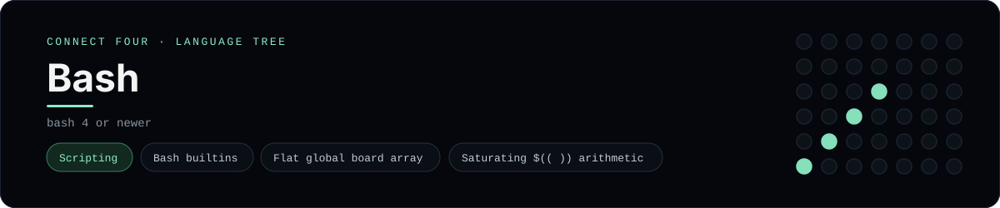

# Bash Implementation

Pure bash: builtins only, a flat array board and command substitution for the pure helpers - one of 41 implementations of the same console protocol in the
[Neo-Connect-Four-Language-Tree](../../README.md) repository. Every
implementation reads the same stdin and prints byte-for-byte identical
output, so a single master test verifies them all at once.

## Prerequisites

* **Toolchain:** bash 4 or newer
* **Check it is installed:** `bash --version`

| Platform | Install command |
| --- | --- |
| Windows | `Git for Windows or MSYS2 (neither puts `bash` on `PATH`)` |
| macOS | `brew install bash` |
| Debian/Ubuntu | `apt-get install bash` |

## How to run

Build this implementation and replay every scenario (from the repository
root):

```sh
python tests/run_tests.py
```

Play it on its own:

```sh
bash --noprofile --norc languages/bash/connect_four.sh
```

### Notes

* Windows ships no bash and neither Git for Windows nor MSYS2 adds it to `PATH`, so the runner looks for `C:\Program Files\Git\bin\bash.exe`, then its `usr\bin`, then `C:\msys64\usr\bin\bash.exe`.
* Bash functions cannot return strings and capturing a prompt-printing function would swallow its output, so `ask_column` prints through and hands its answer back in the global `$CHOSEN_COLUMN`; only the pure helpers are captured with `$(...)`.

## Skills demonstrated

* Bash builtins
* Flat global board array
* Saturating $(( )) arithmetic

## Verified output

The runner replays the eight scripted sessions in
[`tests/inputs/`](../../tests/inputs) and compares stdout with the goldens in
[`tests/expected/`](../../tests/expected) byte for byte. It then checks that
the prompt appears before each read while stdin is still open, which is what
separates an interactive program from one that swallows its input up front.
`languages/bash/connect_four.sh` is the only file this implementation needs.

## Protocol

[`README.md`](../../README.md#console-protocol) documents the console
protocol exactly, and [`tests/run_tests.py`](../../tests/run_tests.py) holds
the build and run commands the suite uses for every language. The showcase
dashboard shows this implementation at `index.html?lang=bash`.

This README and its banner are generated by
[`tools/generate_language_readmes.py`](../../tools/generate_language_readmes.py),
which reads the runner's own metadata - so re-run that script rather than
editing them by hand.
