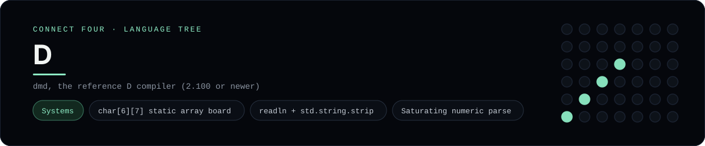

# D Implementation

Static arrays, string slices and a saturating parse from the standard library - one of 44 implementations of the same console protocol in the
[Neo-Connect-Four-Language-Tree](../../README.md) repository. Every
implementation reads the same stdin and prints byte-for-byte identical
output, so a single master test verifies them all at once.

## Prerequisites

* **Toolchain:** dmd, the reference D compiler (2.100 or newer)
* **Check it is installed:** `dmd --version`

| Platform | Install command |
| --- | --- |
| Windows | `winget install Dlang.DMD (or choco install dmd)` |
| macOS | `brew install dmd` |
| Debian/Ubuntu | `apt-get install dmd (or the official install.sh)` |

## How to run

Build this implementation and replay every scenario (from the repository
root):

```sh
python tests/run_tests.py
```

Build and play it on its own:

```sh
dmd -of=tests/build/connect_four_d.exe -od=tests/build languages/d/connect_four.d
./tests/build/connect_four_d
```

### Notes

* On Windows the built program is `tests/build/connect_four_d.exe`; on other platforms the `.exe` suffix is dropped.
* DMD is installed here through winget, which does not update the `PATH` of an already-running shell, so the runner adds its `bin` directory. That same directory must be on `PATH` at run time, because the Windows package links programs against `msvcr120.dll`, which ships beside `dmd.exe` rather than in `System32`.
* On Windows `dmd` builds a 32-bit executable by default (it runs fine on x64); `-od` keeps the object file in `tests/build`, so nothing is written next to the source.

## Skills demonstrated

* char[6][7] static array board
* readln + std.string.strip
* Saturating numeric parse

## Verified output

The runner replays the eight scripted sessions in
[`tests/inputs/`](../../tests/inputs) and compares stdout with the goldens in
[`tests/expected/`](../../tests/expected) byte for byte. It then checks that
the prompt appears before each read while stdin is still open, which is what
separates an interactive program from one that swallows its input up front.
`languages/d/connect_four.d` is the only file this implementation needs.

## Protocol

[`README.md`](../../README.md#console-protocol) documents the console
protocol exactly, and [`tests/run_tests.py`](../../tests/run_tests.py) holds
the build and run commands the suite uses for every language. The showcase
dashboard shows this implementation at `index.html?lang=d`.

This README and its banner are generated by
[`tools/generate_language_readmes.py`](../../tools/generate_language_readmes.py),
which reads the runner's own metadata - so re-run that script rather than
editing them by hand.
