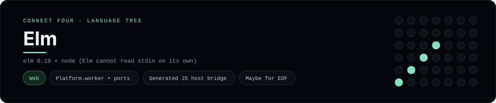

# Elm Implementation

Elm as a Platform.worker, driven by a small JavaScript host over ports - one of 44 implementations of the same console protocol in the
[Neo-Connect-Four-Language-Tree](../../README.md) repository. Every
implementation reads the same stdin and prints byte-for-byte identical
output, so a single master test verifies them all at once.

## Prerequisites

* **Toolchain:** elm 0.19 + node (Elm cannot read stdin on its own)
* **Check it is installed:** `elm --version && node --version`

| Platform | Install command |
| --- | --- |
| Windows | `scoop install elm, plus winget install OpenJS.NodeJS` |
| macOS | `brew install elm node` |
| Debian/Ubuntu | `apt-get install elm nodejs` |

## How to run

Build this implementation and replay every scenario (from the repository
root):

```sh
python tests/run_tests.py
```

Build and play it on its own:

```sh
cd tests/build/elm
elm make src/ConnectFour.elm --optimize --output=connect_four.js
node host.js
```

### Notes

* A console Elm program has to be a `Platform.worker` with ports, so the runner's `_elm_project()` assembles a throwaway project in `tests/build/elm/` first: it writes `elm.json` and `host.js` and copies the module in as `src/ConnectFour.elm`. Run the suite once and the commands above work.
* `--optimize` is not only for speed - it also suppresses the runtime's dev-mode notice, which would otherwise land on stderr and break the byte-for-byte comparison.

## Skills demonstrated

* Platform.worker + ports
* Generated JS host bridge
* Maybe for EOF

## Verified output

The runner replays the eight scripted sessions in
[`tests/inputs/`](../../tests/inputs) and compares stdout with the goldens in
[`tests/expected/`](../../tests/expected) byte for byte. It then checks that
the prompt appears before each read while stdin is still open, which is what
separates an interactive program from one that swallows its input up front.
Everything this implementation needs lives in `languages/elm/`.

## Protocol

[`README.md`](../../README.md#console-protocol) documents the console
protocol exactly, and [`tests/run_tests.py`](../../tests/run_tests.py) holds
the build and run commands the suite uses for every language. The showcase
dashboard shows this implementation at `index.html?lang=elm`.

This README and its banner are generated by
[`tools/generate_language_readmes.py`](../../tools/generate_language_readmes.py),
which reads the runner's own metadata - so re-run that script rather than
editing them by hand.
