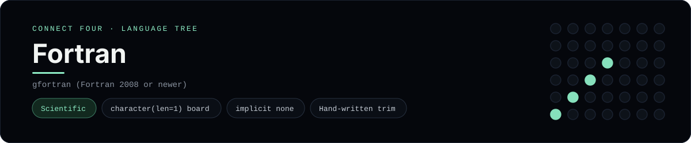

# Fortran Implementation

Fortran with a character board and a hand-written whitespace trim - one of 40 implementations of the same console protocol in the
[Neo-Connect-Four-Language-Tree](../../README.md) repository. Every
implementation reads the same stdin and prints byte-for-byte identical
output, so a single master test verifies them all at once.

## Prerequisites

* **Toolchain:** gfortran (Fortran 2008 or newer)
* **Check it is installed:** `gfortran --version`

| Platform | Install command |
| --- | --- |
| Windows | `winget install BrechtSanders.WinLibs.POSIX.UCRT (or MSYS2: pacman -S mingw-w64-ucrt-x86_64-gcc-fortran)` |
| macOS | `brew install gcc` |
| Debian/Ubuntu | `apt-get install gfortran` |

## How to run

Build this implementation and replay every scenario (from the repository
root):

```sh
python tests/run_tests.py
```

Build and play it on its own:

```sh
gfortran -O2 -o tests/build/connect_four_fortran languages/fortran/connect_four.f90
./tests/build/connect_four_fortran
```

### Notes

* On Windows the built program is `tests/build/connect_four_fortran.exe`; on other platforms the `.exe` suffix is dropped.
* It needs the x86-64 MinGW-w64 toolchain, which the runner selects with `mingw64_env()` - GnuCOBOL's 32-bit MinGW will not do.
* The token is trimmed by a hand-written function covering the same whitespace set as C's `isspace`, rather than `adjustl`/`trim` alone, because the program works wholly on fixed-length `character` values.

## Skills demonstrated

* character(len=1) board
* implicit none
* Hand-written trim

## Verified output

The runner replays the eight scripted sessions in
[`tests/inputs/`](../../tests/inputs) and compares stdout with the goldens in
[`tests/expected/`](../../tests/expected) byte for byte. It then checks that
the prompt appears before each read while stdin is still open, which is what
separates an interactive program from one that swallows its input up front.
`languages/fortran/connect_four.f90` is the only file this implementation needs.

## Protocol

[`README.md`](../../README.md#console-protocol) documents the console
protocol exactly, and [`tests/run_tests.py`](../../tests/run_tests.py) holds
the build and run commands the suite uses for every language. The showcase
dashboard shows this implementation at `index.html?lang=fortran`.

This README and its banner are generated by
[`tools/generate_language_readmes.py`](../../tools/generate_language_readmes.py),
which reads the runner's own metadata - so re-run that script rather than
editing them by hand.
