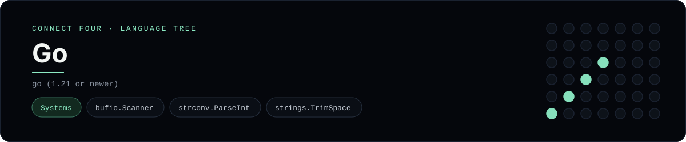

# Go Implementation

Go with a bufio.Scanner and strconv for the whole line protocol - one of 41 implementations of the same console protocol in the
[Neo-Connect-Four-Language-Tree](../../README.md) repository. Every
implementation reads the same stdin and prints byte-for-byte identical
output, so a single master test verifies them all at once.

## Prerequisites

* **Toolchain:** go (1.21 or newer)
* **Check it is installed:** `go version`

| Platform | Install command |
| --- | --- |
| Windows | `winget install GoLang.Go` |
| macOS | `brew install go` |
| Debian/Ubuntu | `apt-get install golang-go` |

## How to run

Build this implementation and replay every scenario (from the repository
root):

```sh
python tests/run_tests.py
```

Build and play it on its own:

```sh
go build -o tests/build/connect_four_go languages/go/connect_four.go
./tests/build/connect_four_go
```

### Notes

* On Windows the built program is `tests/build/connect_four_go.exe`; on other platforms the `.exe` suffix is dropped.

## Skills demonstrated

* bufio.Scanner
* strconv.ParseInt
* strings.TrimSpace

## Verified output

The runner replays the eight scripted sessions in
[`tests/inputs/`](../../tests/inputs) and compares stdout with the goldens in
[`tests/expected/`](../../tests/expected) byte for byte. It then checks that
the prompt appears before each read while stdin is still open, which is what
separates an interactive program from one that swallows its input up front.
`languages/go/connect_four.go` is the only file this implementation needs.

## Protocol

[`README.md`](../../README.md#console-protocol) documents the console
protocol exactly, and [`tests/run_tests.py`](../../tests/run_tests.py) holds
the build and run commands the suite uses for every language. The showcase
dashboard shows this implementation at `index.html?lang=go`.

This README and its banner are generated by
[`tools/generate_language_readmes.py`](../../tools/generate_language_readmes.py),
which reads the runner's own metadata - so re-run that script rather than
editing them by hand.
