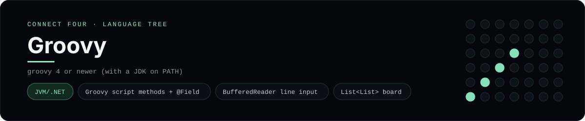

# Groovy Implementation

Groovy as a JVM script, with a List<List> board and a saturating parse - one of 41 implementations of the same console protocol in the
[Neo-Connect-Four-Language-Tree](../../README.md) repository. Every
implementation reads the same stdin and prints byte-for-byte identical
output, so a single master test verifies them all at once.

## Prerequisites

* **Toolchain:** groovy 4 or newer (with a JDK on PATH)
* **Check it is installed:** `groovy --version`

| Platform | Install command |
| --- | --- |
| Windows | `scoop install groovy` |
| macOS | `brew install groovy` |
| Debian/Ubuntu | `apt-get install groovy` |

## How to run

Build this implementation and replay every scenario (from the repository
root):

```sh
python tests/run_tests.py
```

Play it on its own:

```sh
groovy languages/groovy/connect_four.groovy
```

### Notes

* Groovy is a JVM language, so it needs a JDK on `PATH`; on Windows `scoop install groovy` puts a `groovy.cmd` shim there, which the runner resolves like the other `.cmd` toolchains.
* `@Field` promotes the script's constants and the shared `BufferedReader` to fields so the helper methods can see them - a plain script-level local is not visible to a method. The parse saturates at `Long.MAX_VALUE` like the other implementations.

## Skills demonstrated

* Groovy script methods + @Field
* BufferedReader line input
* List<List> board

## Verified output

The runner replays the eight scripted sessions in
[`tests/inputs/`](../../tests/inputs) and compares stdout with the goldens in
[`tests/expected/`](../../tests/expected) byte for byte. It then checks that
the prompt appears before each read while stdin is still open, which is what
separates an interactive program from one that swallows its input up front.
`languages/groovy/connect_four.groovy` is the only file this implementation needs.

## Protocol

[`README.md`](../../README.md#console-protocol) documents the console
protocol exactly, and [`tests/run_tests.py`](../../tests/run_tests.py) holds
the build and run commands the suite uses for every language. The showcase
dashboard shows this implementation at `index.html?lang=groovy`.

This README and its banner are generated by
[`tools/generate_language_readmes.py`](../../tools/generate_language_readmes.py),
which reads the runner's own metadata - so re-run that script rather than
editing them by hand.
