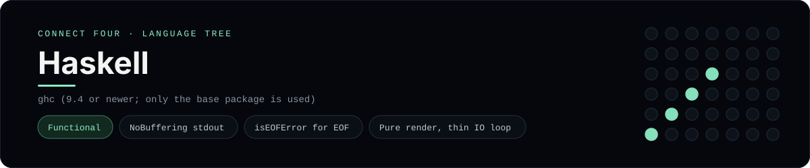

# Haskell Implementation

Haskell with a pure board renderer and a small IO loop - one of 41 implementations of the same console protocol in the
[Neo-Connect-Four-Language-Tree](../../README.md) repository. Every
implementation reads the same stdin and prints byte-for-byte identical
output, so a single master test verifies them all at once.

## Prerequisites

* **Toolchain:** ghc (9.4 or newer; only the base package is used)
* **Check it is installed:** `ghc --version`

| Platform | Install command |
| --- | --- |
| Windows | `choco install ghc (or scoop install ghc)` |
| macOS | `brew install ghc` |
| Debian/Ubuntu | `apt-get install ghc` |

## How to run

Build this implementation and replay every scenario (from the repository
root):

```sh
python tests/run_tests.py
```

Build and play it on its own:

```sh
ghc -O2 -outputdir tests/build/haskell -o tests/build/connect_four_haskell languages/haskell/connect_four.hs
./tests/build/connect_four_haskell
```

### Notes

* On Windows the built program is `tests/build/connect_four_haskell.exe`; on other platforms the `.exe` suffix is dropped.
* `-outputdir tests/build/haskell` keeps the `.hi` and `.o` files out of the source directory, and because only `base` is used there is no cabal or stack project to set up.
* `stdout` is switched to `NoBuffering` so every prompt is visible before the read; end of input is detected with `isEOFError` from the caught `getLine`.

## Skills demonstrated

* NoBuffering stdout
* isEOFError for EOF
* Pure render, thin IO loop

## Verified output

The runner replays the eight scripted sessions in
[`tests/inputs/`](../../tests/inputs) and compares stdout with the goldens in
[`tests/expected/`](../../tests/expected) byte for byte. It then checks that
the prompt appears before each read while stdin is still open, which is what
separates an interactive program from one that swallows its input up front.
`languages/haskell/connect_four.hs` is the only file this implementation needs.

## Protocol

[`README.md`](../../README.md#console-protocol) documents the console
protocol exactly, and [`tests/run_tests.py`](../../tests/run_tests.py) holds
the build and run commands the suite uses for every language. The showcase
dashboard shows this implementation at `index.html?lang=haskell`.

This README and its banner are generated by
[`tools/generate_language_readmes.py`](../../tools/generate_language_readmes.py),
which reads the runner's own metadata - so re-run that script rather than
editing them by hand.
