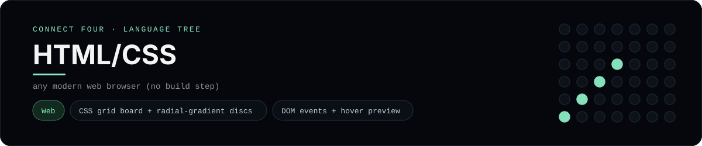

# HTML/CSS Implementation

A self-contained HTML, CSS and JavaScript page with red and yellow discs - the one showcase here that is **not** a console program. It lives in
`languages/` beside the others, but a web page cannot read stdin or print the
golden stdout, so it is deliberately **excluded** from the byte-for-byte suite
([`tests/run_tests.py`](../../tests/run_tests.py)) and the dashboard shows a
live, playable preview instead of a console capture.

## Prerequisites

* **Toolchain:** any modern web browser (no build step)
* **To play it:** open the file in a browser - or use the dashboard's **Play** tab.

## How to run

There is nothing to build: open `languages/htmlcss/connect_four.html`
in any browser (double-click it, or drag it onto a browser window). The board is
a 6x7 grid; click a column to drop a red or yellow disc, and the first player to
line up four wins.

## Skills demonstrated

* CSS grid board + radial-gradient discs
* DOM events + hover preview
* Win detection in vanilla JavaScript

## Why there is no console capture

The master suite only knows how to feed a program stdin and diff its stdout, so
this implementation is skipped there on purpose. Its board and win detection use
the same seven-column logic as the console implementations, and the dashboard's
**Play** tab renders the page in an iframe so you can actually play it - red
against yellow.

This README and its banner are generated by
[`tools/generate_language_readmes.py`](../../tools/generate_language_readmes.py),
which reads the runner's own metadata - so re-run that script rather than
editing them by hand.
