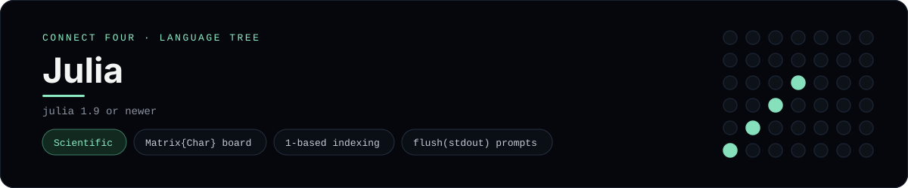

# Julia Implementation

Julia with a Matrix{Char} board and 1-based indexing straight from the input - one of 40 implementations of the same console protocol in the
[Neo-Connect-Four-Language-Tree](../../README.md) repository. Every
implementation reads the same stdin and prints byte-for-byte identical
output, so a single master test verifies them all at once.

## Prerequisites

* **Toolchain:** julia 1.9 or newer
* **Check it is installed:** `julia --version`

| Platform | Install command |
| --- | --- |
| Windows | `scoop install julia` |
| macOS | `brew install julia` |
| Debian/Ubuntu | `apt-get install julia` |

## How to run

Build this implementation and replay every scenario (from the repository
root):

```sh
python tests/run_tests.py
```

Play it on its own:

```sh
julia --startup-file=no --color=no languages/julia/connect_four.jl
```

### Notes

* `--startup-file=no --color=no` keeps startup fast and stderr clean.
* `print` needs an explicit `flush(stdout)` before each read, and end of input is detected with `eof(stdin)` *before* calling `readline()` - that function returns `""` both at EOF and for an empty line.

## Skills demonstrated

* Matrix{Char} board
* 1-based indexing
* flush(stdout) prompts

## Verified output

The runner replays the eight scripted sessions in
[`tests/inputs/`](../../tests/inputs) and compares stdout with the goldens in
[`tests/expected/`](../../tests/expected) byte for byte. It then checks that
the prompt appears before each read while stdin is still open, which is what
separates an interactive program from one that swallows its input up front.
`languages/julia/connect_four.jl` is the only file this implementation needs.

## Protocol

[`README.md`](../../README.md#console-protocol) documents the console
protocol exactly, and [`tests/run_tests.py`](../../tests/run_tests.py) holds
the build and run commands the suite uses for every language. The showcase
dashboard shows this implementation at `index.html?lang=julia`.

This README and its banner are generated by
[`tools/generate_language_readmes.py`](../../tools/generate_language_readmes.py),
which reads the runner's own metadata - so re-run that script rather than
editing them by hand.
