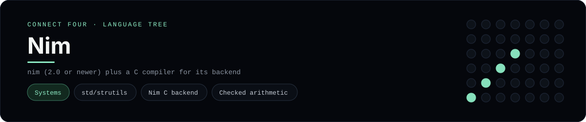

# Nim Implementation

Nim compiled through its C backend, with checked arithmetic - one of 40 implementations of the same console protocol in the
[Neo-Connect-Four-Language-Tree](../../README.md) repository. Every
implementation reads the same stdin and prints byte-for-byte identical
output, so a single master test verifies them all at once.

## Prerequisites

* **Toolchain:** nim (2.0 or newer) plus a C compiler for its backend
* **Check it is installed:** `nim --version`

| Platform | Install command |
| --- | --- |
| Windows | `choco install nim (or scoop install nim)` |
| macOS | `brew install nim` |
| Debian/Ubuntu | `apt-get install nim` |

## How to run

Build this implementation and replay every scenario (from the repository
root):

```sh
python tests/run_tests.py
```

Build and play it on its own:

```sh
nim c --hints:off --warnings:off -d:release --nimcache:tests/build/nimcache -o:tests/build/connect_four_nim languages/nim/connect_four.nim
./tests/build/connect_four_nim
```

### Notes

* On Windows the built program is `tests/build/connect_four_nim.exe`; on other platforms the `.exe` suffix is dropped.
* Nim compiles through a C compiler, so it needs the same x86-64 MinGW-w64 `gcc` the C implementation uses; the runner selects it with `mingw64_env()`.
* `--nimcache:tests/build/nimcache` keeps Nim's generated C out of the source directory.

## Skills demonstrated

* std/strutils
* Nim C backend
* Checked arithmetic

## Verified output

The runner replays the eight scripted sessions in
[`tests/inputs/`](../../tests/inputs) and compares stdout with the goldens in
[`tests/expected/`](../../tests/expected) byte for byte. It then checks that
the prompt appears before each read while stdin is still open, which is what
separates an interactive program from one that swallows its input up front.
`languages/nim/connect_four.nim` is the only file this implementation needs.

## Protocol

[`README.md`](../../README.md#console-protocol) documents the console
protocol exactly, and [`tests/run_tests.py`](../../tests/run_tests.py) holds
the build and run commands the suite uses for every language. The showcase
dashboard shows this implementation at `index.html?lang=nim`.

This README and its banner are generated by
[`tools/generate_language_readmes.py`](../../tools/generate_language_readmes.py),
which reads the runner's own metadata - so re-run that script rather than
editing them by hand.
