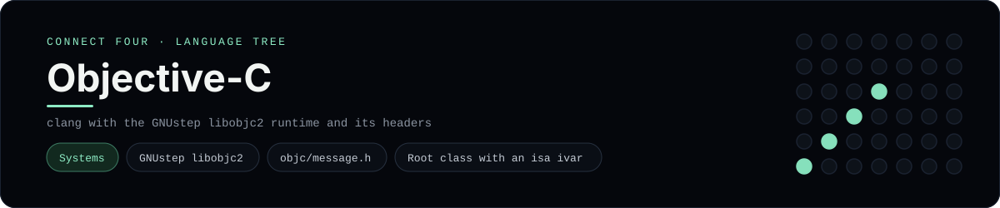

# Objective-C Implementation

Objective-C messaging a small root class on the GNUstep runtime - one of 41 implementations of the same console protocol in the
[Neo-Connect-Four-Language-Tree](../../README.md) repository. Every
implementation reads the same stdin and prints byte-for-byte identical
output, so a single master test verifies them all at once.

## Prerequisites

* **Toolchain:** clang with the GNUstep libobjc2 runtime and its headers
* **Check it is installed:** `clang --version`

| Platform | Install command |
| --- | --- |
| Windows | `pacman -S mingw-w64-clang-x86_64-clang mingw-w64-clang-x86_64-libobjc2 (MSYS2 clang64)` |
| macOS | `xcode-select --install` |
| Debian/Ubuntu | `apt-get install clang libobjc2-dev` |

## How to run

Build this implementation and replay every scenario (from the repository
root):

```sh
python tests/run_tests.py
```

Build and play it on its own:

```sh
clang -fobjc-runtime=gnustep-2.0 -O2 -o tests/build/connect_four_objc languages/objectivec/connect_four.m -lobjc
./tests/build/connect_four_objc
```

### Notes

* On Windows the built program is `tests/build/connect_four_objc.exe`; on other platforms the `.exe` suffix is dropped.
* On Windows this uses MSYS2's clang64 environment, because Windows has no first-party Objective-C runtime. That `bin` directory has to be on `PATH` for the build *and* the run, since libobjc2 ships as `libobjc-4.6.dll`; the runner handles it with `msys2_clang_env()`.
* A root class must declare the `isa` ivar and carry `__attribute__((objc_root_class))`; without the ivar, clang computes an instance size that leaves out the isa pointer and every message send returns nil.

## Skills demonstrated

* GNUstep libobjc2
* objc/message.h
* Root class with an isa ivar

## Verified output

The runner replays the eight scripted sessions in
[`tests/inputs/`](../../tests/inputs) and compares stdout with the goldens in
[`tests/expected/`](../../tests/expected) byte for byte. It then checks that
the prompt appears before each read while stdin is still open, which is what
separates an interactive program from one that swallows its input up front.
`languages/objectivec/connect_four.m` is the only file this implementation needs.

## Protocol

[`README.md`](../../README.md#console-protocol) documents the console
protocol exactly, and [`tests/run_tests.py`](../../tests/run_tests.py) holds
the build and run commands the suite uses for every language. The showcase
dashboard shows this implementation at `index.html?lang=objectivec`.

This README and its banner are generated by
[`tools/generate_language_readmes.py`](../../tools/generate_language_readmes.py),
which reads the runner's own metadata - so re-run that script rather than
editing them by hand.
