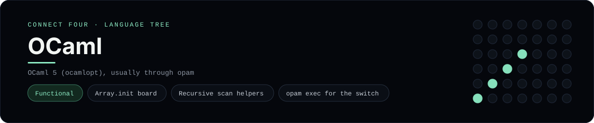

# OCaml Implementation

OCaml with array-of-array state and a recursive column scan - one of 44 implementations of the same console protocol in the
[Neo-Connect-Four-Language-Tree](../../README.md) repository. Every
implementation reads the same stdin and prints byte-for-byte identical
output, so a single master test verifies them all at once.

## Prerequisites

* **Toolchain:** OCaml 5 (ocamlopt), usually through opam
* **Check it is installed:** `ocamlopt -version`

| Platform | Install command |
| --- | --- |
| Windows | `winget install OCaml.opam, then opam init and opam switch create` |
| macOS | `brew install opam` |
| Debian/Ubuntu | `apt-get install opam` |

## How to run

Build this implementation and replay every scenario (from the repository
root):

```sh
python tests/run_tests.py
```

Build and play it on its own:

```sh
opam exec -- ocamlopt -o tests/build/connect_four_ocaml languages/ocaml/connect_four.ml
./tests/build/connect_four_ocaml
```

### Notes

* On Windows the built program is `tests/build/connect_four_ocaml.exe`; on other platforms the `.exe` suffix is dropped.
* `opam exec -- ocamlopt` works without sourcing the switch environment first, because an opam switch is self-contained.
* `ocamlopt` has no output directory option and drops `connect_four.cmi`/`.cmx`/`.o` next to the source - those extensions are in `.gitignore`.

## Skills demonstrated

* Array.init board
* Recursive scan helpers
* opam exec for the switch

## Verified output

The runner replays the eight scripted sessions in
[`tests/inputs/`](../../tests/inputs) and compares stdout with the goldens in
[`tests/expected/`](../../tests/expected) byte for byte. It then checks that
the prompt appears before each read while stdin is still open, which is what
separates an interactive program from one that swallows its input up front.
`languages/ocaml/connect_four.ml` is the only file this implementation needs.

## Protocol

[`README.md`](../../README.md#console-protocol) documents the console
protocol exactly, and [`tests/run_tests.py`](../../tests/run_tests.py) holds
the build and run commands the suite uses for every language. The showcase
dashboard shows this implementation at `index.html?lang=ocaml`.

This README and its banner are generated by
[`tools/generate_language_readmes.py`](../../tools/generate_language_readmes.py),
which reads the runner's own metadata - so re-run that script rather than
editing them by hand.
